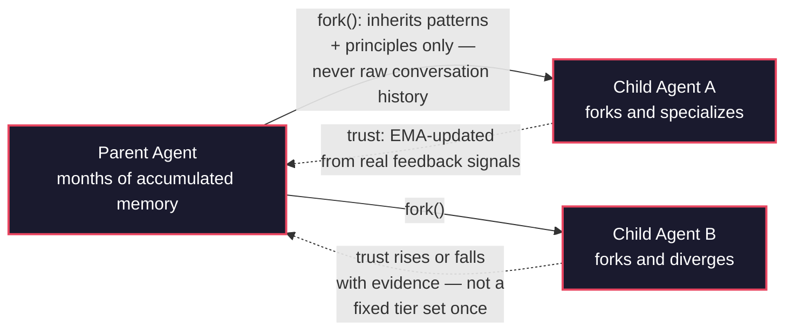
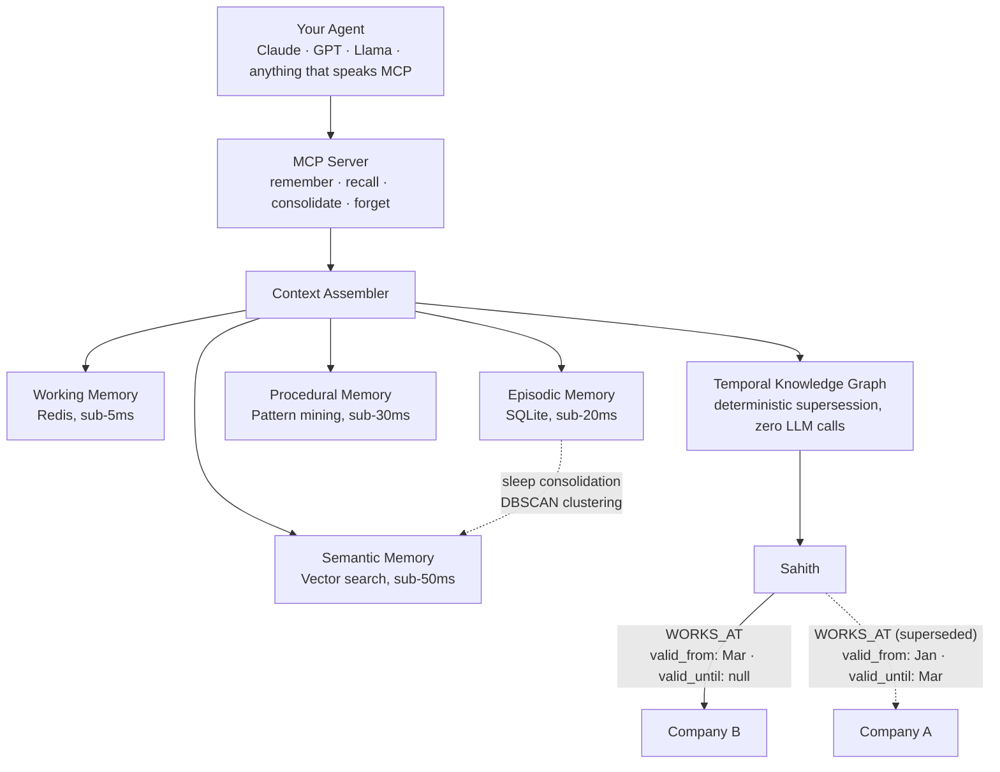

# AgentMem OS

[](https://github.com/Sahith59/AgentMem-OS/actions/workflows/ci.yml)

**Git for agent memory.**

Child agents fork a parent's memory, inherit only what generalized, and diverge from there. Trust between agents is a number that's earned and lost through evidence, not a permission slip assigned once and forgotten. And the whole thing runs on your machine — no cloud dependency, no API key required to get started.

Most memory systems give an agent a bigger notebook. AgentMem OS gives a fleet of agents a version-controlled, trust-weighted, temporally-aware one.

---

## The idea, in one diagram



A child never gets to read its parent's raw conversations — only the abstracted patterns and principles that survived generalization. Trust between any two agents starts neutral and moves with an exponentially-weighted moving average of real feedback: `trust_new = 0.80 × trust_old + 0.20 × signal`. Nothing here is assigned by hand and left to rot.

---

## What's actually running underneath



Four memory tiers plus a knowledge graph that knows when a fact *stopped* being true, not just that it once existed — "Sahith works at Company A" is correctly superseded, not silently overwritten, when a later conversation says "Sahith joined Company B." Zero LLM calls in that supersession path: same-subject, same-relation-type, later timestamp wins, deterministically.

---

## What makes this different

- **Dynamic trust, not static tiers.** The most credible funded competitor in this space assigns four fixed, manually-set trust tiers at credential mint-time, changed only by an explicit API call. Trust here is a live number, continuously updated from evidence — an agent that starts unreliable and improves is *believed* more over time; one that degrades is trusted less, automatically, without anyone flipping a switch.
- **Fork, not just share.** Child agents inherit their parent's abstracted knowledge (patterns and principles) and start with a clean episodic slate — the first formalization of git-style memory branching for LLM agents. Raw episodic memory never leaves the agent that produced it.
- **A temporal knowledge graph that doesn't lie about the past.** Facts are bi-temporally scoped (`valid_from` / `valid_until`), with deterministic, zero-LLM-call supersession. Ask "what did we know as of last Tuesday" and get an answer scoped to that moment, not today's.
- **Cross-lingual entity resolution, measured honestly.** A fact stored in one language resolving correctly when queried in another is a real, unsolved gap in this space right now — even funded competitors have open, unresolved issues asking for it. Measured here on a hand-labeled English/Hindi/Tamil dataset with adversarial hard negatives, not just the easy cases: **76% precision / 53% recall at the safest operating point**, with the honest surviving gap (two phonetically-similar-but-unrelated places still get confused) reported alongside the win, not hidden under it. And it's not just an eval script — the measured threshold is **wired into the live knowledge graph**: a Hindi query lands on memory stored in English, via non-destructive `ALIAS_OF` edges that can add retrieval reach but never corrupt a fact.
- **100% local-first.** Every tier runs on your machine. No API key is required to get started — plug in Claude, GPT, or a fully local Ollama model interchangeably.
- **Benchmarked against real systems, not simulations.** Every number below comes from a script in [`benchmarks/`](benchmarks/) that either runs the actual production code path or a real competitor's own installed library — never a hand-rolled proxy standing in for either. See [`benchmarks/deprecated_proxy_sim/`](benchmarks/deprecated_proxy_sim/) for the earlier simulation-based scripts, kept only for historical reference and explicitly not cited anywhere below.

---

## Real, measured results

**Multi-agent trust actually matters, measurably.** A controlled scenario with one deliberately unreliable agent among four honest ones, exercising the real trust/federation/fork code directly (not a reimplementation of the formulas):

| Configuration | Retrieval precision |
|---|---|
| Full system (dynamic trust + fork inheritance) | **0.951** |
| No trust-weighting at all | 0.625 |

The unreliable agent's trust score, as perceived by every honest agent, over the course of the run: **0.50 → 0.30 → 0.27** — the system learns who not to believe, without anyone telling it to.

**Cross-lingual entity resolution, at every threshold tested** (English/Hindi/Tamil, 30 genuine same-entity pairs + 6 adversarial hard negatives):

| Threshold | Precision | Recall | F1 |
|---|---|---|---|
| 0.80 | 0.135 | 1.000 | 0.238 |
| 0.85 | 0.422 | 0.900 | 0.575 |
| **0.90** | **0.762** | **0.533** | **0.628** |
| 0.95 | 1.000 | 0.200 | 0.333 |

τ = 0.90 (the measured F1-optimal) ships as the live default in [`db/entity_aliases.py`](db/entity_aliases.py): an Indic-script mention only enters the graph when it embedding-matches an entity the graph already knows, and the link is stored as a non-destructive `ALIAS_OF` edge carrying its cosine similarity — never a node merge, so a false alias adds retrieval noise but can never corrupt or delete a fact. Optional install (pulls torch): `pip install -e ".[multilingual]"`.

A real, code-level ablation (committed in [`benchmarks/ablation_real_results.json`](benchmarks/ablation_real_results.json)) shows the semantic tier is load-bearing: disabling it collapses internal context-relevance roughly **3×**. Internal proxy metrics like that one stay out of this README's tables on purpose — they have no external reference point, and no claim in this repo rests on them. Everything below is the QA-accuracy methodology the field actually publishes.

**Real QA-accuracy head-to-head — pilot scale (n=30, fixed seed 42), on real [LongMemEval](https://arxiv.org/abs/2410.10813) (oracle split).** Every system answered the same 30 questions, with the same retrieval budget, the same answer layer, the same generator (gpt-4o-mini) and the same judge (gpt-4o) — real libraries, not simulations:

| System | LongMemEval QA-accuracy |
|---|---|
| **AgentMem OS** | **76.7%** |
| Letta (archival-memory scoping*) | 66.7% |
| Mem0 (OSS, gpt-4o-mini extraction) | 56.7% |
| LangMem | 36.7% |
| Recent-turns-only floor | 33.3% |
| *Oracle ceiling — no retrieval at all* | *83.3%* |

That last row is the number most benchmark tables leave out, and it's the one that makes the rest interpretable. It hands the answerer the gold sessions **directly, with retrieval switched off** — so it is the maximum score *any* memory system can reach against this data, answerer, and judge. AgentMem OS reaches **92% of that ceiling**. A memory system's job is to find the right memory; measuring it without knowing what perfect retrieval would score tells you nothing about whether a gap is the system's fault or the benchmark's.

Publishing that ceiling caught three real bugs in **this repo's own harness**: LongMemEval ships a per-question reference date (`question_date`) and per-session dates (`haystack_dates`) that the loader silently dropped, and sessions were truncated to 20 turns × 300 chars. Every "how many days ago…" question — 27% of the dataset — was unanswerable by construction. Fixing the loader moved the ceiling from 46.7% to 83.3% and this system from 46.7% to 76.7%, with **zero changes to the memory system itself**. If your harness has never been ceiling-tested, its numbers are unvalidated — ours were, and they were wrong.

**On [LoCoMo](https://arxiv.org/abs/2402.17753)** an earlier pilot under the old naive answer layer scored AgentMem OS 30.0% / Mem0 26.7% / Letta 6.7% / LangMem 6.7% / floor 0.0%. Those numbers predate the loader fixes and the date-anchored answer layer above and are **not** comparable to this table — LoCoMo is queued for a clean re-run under the current configuration, and this README will carry it once it exists.

Raw per-question outputs for every row: [`benchmarks/reports/`](benchmarks/reports/), [`benchmarks/qa_accuracy_longmemeval.json`](benchmarks/qa_accuracy_longmemeval.json), [`benchmarks/oracle_ceiling_longmemeval.json`](benchmarks/oracle_ceiling_longmemeval.json). *Letta is deliberately scoped to archival-memory retrieval only; the disclosure travels inside its result file.

### How this benchmark tries not to fool itself

The failure mode in this space isn't lying, it's that **whoever runs the benchmark configures their competitors** — and configuring someone else's system well is genuinely hard. Zep has [publicly shown](https://blog.getzep.com/lies-damn-lies-statistics-is-mem0-really-sota-in-agent-memory/) a 17-point swing on their own system depending only on who set it up. Any table where one vendor ran everybody deserves suspicion, **including this one**. So:

**What was done to avoid understating competitors.** When Mem0's adapter crashed on every LoCoMo session (unhandled speaker-name roles → empty-string embedding → HTTP 400), it was debugged and fixed rather than reported as a zero. When LangMem scored 0/30, that was traced to a bug in *this repo's* adapter and fixed before publishing. Every system gets the same extraction model, the same `top_k`, the same answer layer, the same judge, and the same questions.

**Where this setup may still understate them — stated plainly:** Mem0 runs here in its base vector configuration, not the graph configuration its strongest published numbers use. `top_k=10` is uniform, not tuned per system, and retrieval depth is known to be worth several points. Speaker names are folded into message content rather than passed as roles. And **nobody from any competing project has reviewed these adapters** — which is the actual root cause of the Zep incident.

**The invitation, which is the real safeguard:** every adapter is in [`benchmarks/adapters/`](benchmarks/adapters/), every result file holds its per-question outputs, and the seed is fixed. If you maintain one of these systems and this configuration misrepresents it, open an issue or a PR — corrections will be run and published, including ones that move this project down the table. A number nobody can challenge isn't a benchmark, it's marketing.

**Graphiti's row is absent for a reason worth stating plainly:** after **21+ hours** its per-message LLM extraction pipeline had still not finished ingesting the same 30-question haystack every other system ingested in minutes (AgentMem OS: ~40 seconds, locally, at $0), and the run was stopped. That asymmetry — thousands of sequential LLM calls at ingestion time versus local extraction — is itself a finding. A parallelized re-run is planned, and its accuracy number will be added here when it exists, not before.

Two caveats, stated before anyone else can state them: **(1)** n=30 is a pilot, not a full run — the full 500-question LongMemEval and 690-question LoCoMo runs are the next milestone, and these numbers may move. **(2)** Every system here scores below its own published number, including ours. Vendor benchmarks are typically run by the vendor, on the vendor's harness, with the vendor's tuning of every competitor — a setup [Zep and Mem0 have publicly accused each other over](https://blog.getzep.com/lies-damn-lies-statistics-is-mem0-really-sota-in-agent-memory/). This table makes the opposite trade: one harness, one answer layer, one judge, identical for everyone, with the ceiling published so you can see how much of the gap is the systems and how much is the measurement. Every number ships with its raw per-question output and a fixed seed. Run it yourself; that's the point.

**56/56** multi-agent federation formula tests passing, **125+** tests passing across the broader suite. See [`benchmarks/`](benchmarks/) to reproduce every number above yourself.

---

## Quickstart

**Requirements:** Python 3.11+, Redis running locally. No API key required — runs fully offline with Ollama.

```bash
git clone https://github.com/Sahith59/AgentMem-OS.git
cd AgentMem-OS

python3 -m venv venv
source venv/bin/activate      # Windows: venv\Scripts\activate

pip install -r requirements.txt
pip install -e . --no-deps
python -m spacy download en_core_web_sm

cp .env.example .env          # optional: add ANTHROPIC_API_KEY / OPENAI_API_KEY for hosted models

python -c "from agentmem_os.db.engine import init_db; init_db()"
```

```python
import uuid
from agentmem_os.storage.store import ConversationStore
from agentmem_os.llm.context_assembler import ContextAssembler

session_id = f"demo-{uuid.uuid4().hex[:8]}"   # fresh session — memory persists
                                                # across restarts as long as you
                                                # reuse the same session_id
store = ConversationStore()
store.save_turn(session_id, role="user", content="I'm building a rover for a robotics competition.")

assembler = ContextAssembler()
context = assembler.assemble(session_id, query="What am I building?")
print(context)   # correctly recalls the rover, days or months later
```

Or connect any MCP-compatible agent (Claude Desktop, your own LangGraph pipeline) directly — see [`mcp_server/`](mcp_server/) for the 6 exposed tools across both supported transports.

---

## Architecture, in code

```
agentmem_os/
├── agents/                    # Multi-agent memory federation
│   ├── memory_federation.py   #   promote → retrieve → feedback → decay
│   ├── namespace_manager.py   #   fork(), merge_patterns(), lineage tracking
│   └── trust_network.py       #   dynamic EMA trust, transitive propagation
├── api/                       # FastAPI REST interface
├── benchmarks/
│   ├── adapters/               #   Real adapters: Mem0, Graphiti, Letta, LangMem
│   ├── mfp_eval.py             #   Multi-agent federation eval, real code paths
│   ├── cross_lingual_kg_eval.py #  Cross-lingual entity resolution, measured
│   └── eval_harness.py         #   CRS / TES / LCS evaluators
├── cache/                      # Tier 1: Redis working memory
├── cli/                        # Typer CLI
├── db/
│   ├── knowledge_graph.py      # Temporal Knowledge Graph (bi-temporal, NetworkX)
│   ├── engine.py                # SQLAlchemy engine + session factory
│   └── models.py                # Turn, Session, Summary, FederatedMemoryEntry, ...
├── llm/
│   ├── consolidation_engine.py  # Sleep consolidation (DBSCAN clustering)
│   ├── context_assembler.py     # Retrieval across all tiers
│   ├── importance_scorer.py     # EMA-weighted turn importance
│   └── procedural_memory.py     # Recurring interaction pattern mining
├── mcp_server/                  # MCP server — 6 tools, 2 transports
├── memory/
│   └── conflict_detector.py     # Zero-LLM-call contradiction detection
├── storage/
│   └── store.py                 # Coordinates all tiers
└── tests/                       # 100+ tests, real code paths
```

---

## Configuration

```yaml
# config.yaml
models:
  default_model: "ollama/llama3.1"        # fully local, no API key
  fallback_model: "anthropic/claude-haiku-4-5-20251001"
  compression_threshold: 0.70              # trigger consolidation at 70% context

storage:
  base_path: "~/.agentmem_os/"
```

| Model | String | Use case |
|---|---|---|
| Llama 3.1 (local) | `ollama/llama3.1` | Free, fully offline |
| Claude Haiku | `anthropic/claude-haiku-4-5-20251001` | Cheap hosted option |
| Claude Sonnet | `anthropic/claude-sonnet-4-6` | Best quality |
| Groq Llama | `groq/llama-3.1-8b-instant` | Free hosted fallback |

Cross-lingual entity aliasing (optional — `pip install -e ".[multilingual]"`):

| Env var | Default | Meaning |
|---|---|---|
| `AGENTMEM_OS_CROSS_LINGUAL` | `1` | Set `0` to disable even when installed |
| `AGENTMEM_OS_CROSS_LINGUAL_TAU` | `0.90` | Measured F1-optimal; `0.95` = zero measured false positives, much lower recall |

---

## Research

The Memory Federation Protocol — dynamic EMA trust and confidence-decayed parent-child forking — is the subject of an in-progress paper targeting [AAMAS 2027](https://warwick.ac.uk/fac/sci/dcs/aamas2027/calls/). Everything the paper claims traces to a committed script, a raw result file, and a fixed seed in this repository — nothing is asserted without a reproducible number behind it.

---

## Contributing

Issues and PRs welcome. If you're comparing this against another memory system and find a gap in the comparison — or a case where this one is wrong — please open an issue. The benchmark harness is designed to be re-run and argued with, not taken on faith.

---

## License

MIT — see `LICENSE`.
