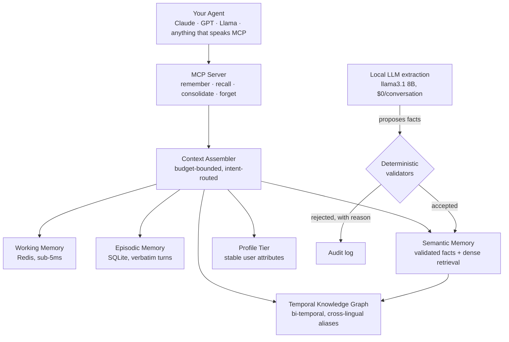

# AgentMem OS

[](https://github.com/Sahith59/AgentMem-OS/actions/workflows/ci.yml)

**Git for agent memory.**

Child agents fork a parent's memory, inherit only what generalized, and diverge from there. Trust between agents is a number that is earned and lost through evidence, not a permission slip assigned once and forgotten. The whole thing runs on your machine: no cloud dependency, no API key required to get started.

Most memory systems give an agent a bigger notebook. AgentMem OS gives a fleet of agents a version-controlled, trust-weighted, temporally aware one. And it is measured the way infrastructure should be: **79.3% ± 1.2 on LongMemEval `_s`** with every knob disclosed, a published failure ledger, and a noise floor we measured before quoting decimals.

---

## Read this repo in 15 minutes

| If you want... | Read |
|---|---|
| The benchmark story: 63.3% to 79.3%, the mechanism, the curve, what is pending | [docs/BENCHMARKS.md](docs/BENCHMARKS.md) |
| Everything that failed, what it cost, and what each failure bought | [docs/FAILURES.md](docs/FAILURES.md) |
| The architectural decisions, why we made them, and how they turned out | [docs/DECISIONS.md](docs/DECISIONS.md) |
| The cross-lingual (Indic) memory frontier: the layer nobody has built | [docs/INDIC_ROADMAP.md](docs/INDIC_ROADMAP.md) |
| Sourced competitor claims and why most published numbers are not comparable | [COMPETITIVE_ANALYSIS.md](COMPETITIVE_ANALYSIS.md) |

We publish negative results and retracted numbers alongside the wins. If that seems unusual, [docs/FAILURES.md](docs/FAILURES.md) explains why it is the point.

---

## The idea, in one diagram


A child never reads its parent's raw conversations, only the abstracted patterns and principles that survived generalization. Trust between any two agents starts neutral and moves with an exponentially weighted moving average of real feedback: `trust_new = 0.80 x trust_old + 0.20 x signal`. Nothing here is assigned by hand and left to rot.

---

## What's actually running underneath



Verbatim conversation evidence stays primary. A local 8B model proposes facts from each conversation and deterministic validators decide what is stored: a fact claiming a number must show that number in something the user actually said, assistant-sourced claims are rejected, and contradictions are superseded with timestamps, never silently deleted. The knowledge graph knows when a fact *stopped* being true, not just that it once existed.

---

## What makes this different

- **A benchmark culture no vendor in this space matches.** Means over 3+ runs with spread, all six comparability knobs disclosed (split, answerer, judge, subset, memory source, context budget), a measured oracle ceiling, pre-registered predictions, and a public failure ledger. See [docs/BENCHMARKS.md](docs/BENCHMARKS.md).
- **Cross-lingual memory, measured honestly.** A fact stored in one language resolving to a query in another is a real, publicly acknowledged gap (the leading graph-memory vendor has multiple open issues asking for it). Ours ships today at a measured operating point (precision 0.762 / recall 0.533 on a hand-labeled EN/Hindi/Tamil set with adversarial negatives), wired into the live graph via non-destructive `ALIAS_OF` edges. The roadmap to the first cross-lingual memory benchmark is [docs/INDIC_ROADMAP.md](docs/INDIC_ROADMAP.md).
- **Extraction that cannot hallucinate silently.** The LLM proposes; deterministic validators decide, with logged rejection reasons. 19,195 sessions extracted into 98,372 validated facts at $0 API cost.
- **Dynamic trust, not static tiers.** Trust is a live number updated from evidence. Measured in an adversarial harness: retrieval precision 0.951 with trust-weighting versus 0.625 without, and an unreliable agent's perceived trust decays 0.50 to 0.27 automatically.
- **Fork, not just share.** Child agents inherit abstracted knowledge and start with a clean episodic slate: the first formalization of git-style memory branching for LLM agents.
- **A temporal knowledge graph that doesn't lie about the past.** Bi-temporal facts (`valid_from` / `valid_until`), deterministic zero-LLM-call supersession, point-in-time queries.
- **100% local-first.** Every tier runs on your machine. Plug in Claude, GPT, or a fully local Ollama model interchangeably.

---

## Results

**Headline, LongMemEval `_s` (the hard split: ~48-session, ~115k-token haystacks per question):**

| Configuration | QA accuracy | Mean context sent |
|---|---|---|
| **AgentMem OS, 40k operating point** | **79.3% ± 1.2** (n=150, mean of 3 runs) | ~9.8k tokens |
| AgentMem OS, 24k operating point | 76.9% ± 1.0 (n=150, mean of 3 runs) | 5,698 tokens |
| Full-context GPT-4o (no memory system) | 60.2% (benchmark authors) | ~115k tokens |
| Measured oracle ceiling (gold evidence handed in) | 86.7% | n/a |

Protocol: GPT-4o answerer, the benchmark's official per-type GPT-4o judge, fixed seed, self-describing result artifacts. Against the *verifiable* published field on this split: full-context 60.2%, Zep's paper 71.2%, TiMem 76.88%. Higher vendor claims exist (90%+) with no answerer or judge disclosed, some exceeding the measured ceiling; [docs/BENCHMARKS.md](docs/BENCHMARKS.md#how-this-compares-to-published-numbers) treats them properly. The full 500-question x 3-run result: _pending, infrastructure ready_.

**Why the number moved (the mechanism, not vibes):** questions whose full gold evidence reaches the context answer at 84.5%; partial coverage collapses to ~44%. Coverage completeness is the master variable, which also makes Recall@k structurally misleading for multi-hop memory. Full analysis in [docs/BENCHMARKS.md](docs/BENCHMARKS.md#the-coverage-finding-the-mechanism-behind-everything).

**Multi-agent trust, measured in harness:**

| Configuration | Retrieval precision |
|---|---|
| Full system (dynamic trust + fork inheritance) | **0.951** |
| No trust-weighting | 0.625 |

**Cross-lingual entity resolution (EN/Hindi/Tamil, hand-labeled, with adversarial negatives):** precision 0.762 / recall 0.533 at the shipped threshold, published at every threshold tested including the failing ones, with the known surviving failure disclosed. Table and design in [docs/INDIC_ROADMAP.md](docs/INDIC_ROADMAP.md).

An earlier n=30 head-to-head against Mem0, Letta, and LangMem (real installed libraries, one harness, oracle split, ceiling published) lives with all its caveats in [docs/BENCHMARKS.md](docs/BENCHMARKS.md). Raw per-question outputs for every number: [`benchmarks/`](benchmarks/).

---

## Quickstart

**Requirements:** Python 3.11+, Redis running locally. No API key required; runs fully offline with Ollama.

```bash
git clone https://github.com/Sahith59/AgentMem-OS.git
cd AgentMem-OS

python3 -m venv venv
source venv/bin/activate      # Windows: venv\Scripts\activate

pip install -r requirements.txt
pip install -e . --no-deps
python -m spacy download en_core_web_sm

cp .env.example .env          # optional: add ANTHROPIC_API_KEY / OPENAI_API_KEY for hosted models

python -c "from agentmem_os.db.engine import init_db; init_db()"
```

```python
import uuid
from agentmem_os.storage.store import ConversationStore
from agentmem_os.llm.context_assembler import ContextAssembler

session_id = f"demo-{uuid.uuid4().hex[:8]}"   # fresh session; memory persists
                                                # across restarts as long as you
                                                # reuse the same session_id
store = ConversationStore()
store.save_turn(session_id, role="user", content="I'm building a rover for a robotics competition.")

assembler = ContextAssembler()
context = assembler.assemble(session_id, query="What am I building?")
print(context)   # correctly recalls the rover, days or months later
```

Or connect any MCP-compatible agent (Claude Desktop, your own LangGraph pipeline) directly. See [`mcp_server/`](mcp_server/) for the 6 exposed tools across both supported transports.

---

## Architecture, in code

```
agentmem_os/
├── agents/                    # Multi-agent memory federation
│   ├── memory_federation.py   #   promote → retrieve → feedback → decay
│   ├── namespace_manager.py   #   fork(), merge_patterns(), lineage tracking
│   └── trust_network.py       #   dynamic EMA trust, transitive propagation
├── api/                       # FastAPI REST interface
├── benchmarks/
│   ├── adapters/               #   Real adapters: Mem0, Graphiti, Letta, LangMem
│   ├── qa_accuracy_eval.py     #   The LongMemEval harness (preflights, provenance)
│   ├── mfp_eval.py             #   Multi-agent federation eval, real code paths
│   └── cross_lingual_kg_eval.py #  Cross-lingual entity resolution, measured
├── cache/                      # Tier 1: Redis working memory
├── cli/                        # Typer CLI
├── db/
│   ├── knowledge_graph.py      # Temporal Knowledge Graph (bi-temporal, NetworkX)
│   ├── entity_aliases.py       # Cross-lingual ALIAS_OF edges (measured τ=0.90)
│   └── models.py               # Turn, Session, SemanticFact, ProfileAttribute, ...
├── llm/
│   ├── consolidation_v2.py     # Extraction + validators + supersession pipeline
│   ├── context_assembler.py    # Budget-bounded retrieval across all tiers
│   └── profile_extractor.py    # Stable-attribute projection from facts
├── mcp_server/                  # MCP server: 6 tools, 2 transports
├── memory/
│   └── conflict_detector.py     # Zero-LLM-call contradiction detection
├── storage/
│   └── store.py                 # Coordinates all tiers
└── tests/                       # 125+ tests, real code paths
```

---

## Configuration

```yaml
# config.yaml
models:
  default_model: "ollama/llama3.1"        # fully local, no API key
  fallback_model: "anthropic/claude-haiku-4-5-20251001"
  compression_threshold: 0.70              # trigger consolidation at 70% context
```

| Model | String | Use case |
|---|---|---|
| Llama 3.1 (local) | `ollama/llama3.1` | Free, fully offline |
| Claude Haiku | `anthropic/claude-haiku-4-5-20251001` | Cheap hosted option |
| Claude Sonnet | `anthropic/claude-sonnet-4-6` | Best quality |
| Groq Llama | `groq/llama-3.1-8b-instant` | Free hosted fallback |

Cross-lingual entity aliasing (optional: `pip install -e ".[multilingual]"`):

| Env var | Default | Meaning |
|---|---|---|
| `AGENTMEM_OS_CROSS_LINGUAL` | `1` | Set `0` to disable even when installed |
| `AGENTMEM_OS_CROSS_LINGUAL_TAU` | `0.90` | Measured F1-optimal; `0.95` = zero measured false positives, much lower recall |

---

## Research

The Memory Federation Protocol (dynamic EMA trust and confidence-decayed parent-child forking) is the subject of an in-progress paper targeting [AAMAS 2027](https://warwick.ac.uk/fac/sci/dcs/aamas2027/calls/). Everything the paper claims traces to a committed script, a raw result file, and a fixed seed in this repository. Nothing is asserted without a reproducible number behind it.

---

## Contributing

Issues and PRs welcome. If you're comparing this against another memory system and find a gap in the comparison, or a case where this one is wrong, please open an issue. The benchmark harness is designed to be re-run and argued with, not taken on faith. Corrections that move this project *down* a table get published too; [docs/FAILURES.md](docs/FAILURES.md) is the proof of that habit.

---

## License

MIT. See `LICENSE`.
