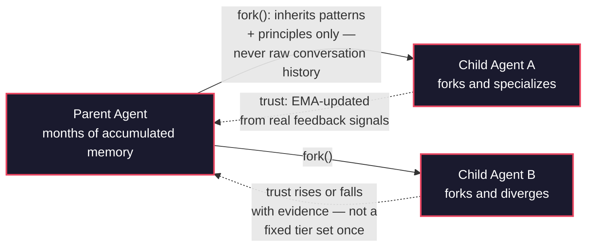
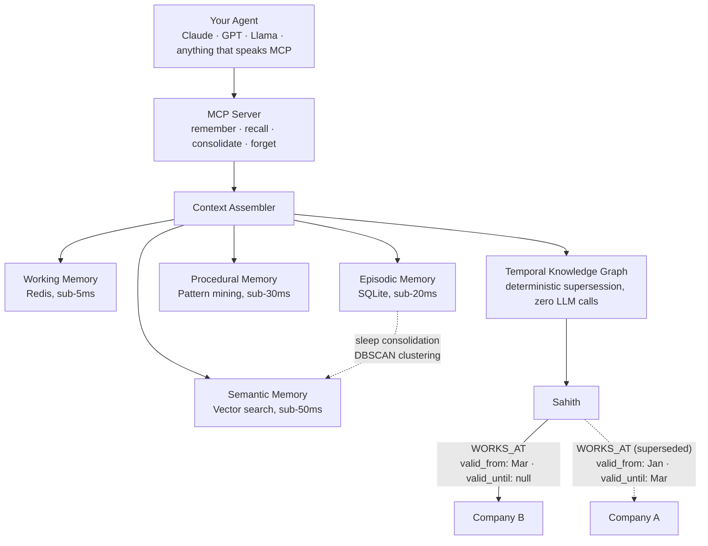

# AgentMem OS

**Git for agent memory.**

Child agents fork a parent's memory, inherit only what generalized, and diverge from there. Trust between agents is a number that's earned and lost through evidence, not a permission slip assigned once and forgotten. And the whole thing runs on your machine — no cloud dependency, no API key required to get started.

Most memory systems give an agent a bigger notebook. AgentMem OS gives a fleet of agents a version-controlled, trust-weighted, temporally-aware one.

---

## The idea, in one diagram



A child never gets to read its parent's raw conversations — only the abstracted patterns and principles that survived generalization. Trust between any two agents starts neutral and moves with an exponentially-weighted moving average of real feedback: `trust_new = 0.80 × trust_old + 0.20 × signal`. Nothing here is assigned by hand and left to rot.

---

## What's actually running underneath



Four memory tiers plus a knowledge graph that knows when a fact *stopped* being true, not just that it once existed — "Sahith works at Company A" is correctly superseded, not silently overwritten, when a later conversation says "Sahith joined Company B." Zero LLM calls in that supersession path: same-subject, same-relation-type, later timestamp wins, deterministically.

---

## What makes this different

- **Dynamic trust, not static tiers.** The most credible funded competitor in this space assigns four fixed, manually-set trust tiers at credential mint-time, changed only by an explicit API call. Trust here is a live number, continuously updated from evidence — an agent that starts unreliable and improves is *believed* more over time; one that degrades is trusted less, automatically, without anyone flipping a switch.
- **Fork, not just share.** Child agents inherit their parent's abstracted knowledge (patterns and principles) and start with a clean episodic slate — the first formalization of git-style memory branching for LLM agents. Raw episodic memory never leaves the agent that produced it.
- **A temporal knowledge graph that doesn't lie about the past.** Facts are bi-temporally scoped (`valid_from` / `valid_until`), with deterministic, zero-LLM-call supersession. Ask "what did we know as of last Tuesday" and get an answer scoped to that moment, not today's.
- **Cross-lingual entity resolution, measured honestly.** A fact stored in one language resolving correctly when queried in another is a real, unsolved gap in this space right now — even funded competitors have open, unresolved issues asking for it. Measured here on a hand-labeled English/Hindi/Tamil dataset with adversarial hard negatives, not just the easy cases: **76% precision / 53% recall at the safest operating point**, with the honest surviving gap (two phonetically-similar-but-unrelated places still get confused) reported alongside the win, not hidden under it.
- **100% local-first.** Every tier runs on your machine. No API key is required to get started — plug in Claude, GPT, or a fully local Ollama model interchangeably.
- **Benchmarked against real systems, not simulations.** Every number below comes from a script in [`benchmarks/`](benchmarks/) that either runs the actual production code path or a real competitor's own installed library — never a hand-rolled proxy standing in for either. See [`benchmarks/deprecated_proxy_sim/`](benchmarks/deprecated_proxy_sim/) for the earlier simulation-based scripts, kept only for historical reference and explicitly not cited anywhere below.

---

## Real, measured results

**Multi-agent trust actually matters, measurably.** A controlled scenario with one deliberately unreliable agent among four honest ones, exercising the real trust/federation/fork code directly (not a reimplementation of the formulas):

| Configuration | Retrieval precision |
|---|---|
| Full system (dynamic trust + fork inheritance) | **0.951** |
| No trust-weighting at all | 0.625 |

The unreliable agent's trust score, as perceived by every honest agent, over the course of the run: **0.50 → 0.30 → 0.27** — the system learns who not to believe, without anyone telling it to.

**Cross-lingual entity resolution, at every threshold tested** (English/Hindi/Tamil, 30 genuine same-entity pairs + 6 adversarial hard negatives):

| Threshold | Precision | Recall | F1 |
|---|---|---|---|
| 0.80 | 0.135 | 1.000 | 0.238 |
| 0.85 | 0.422 | 0.900 | 0.575 |
| **0.90** | **0.762** | **0.533** | **0.628** |
| 0.95 | 1.000 | 0.200 | 0.333 |

**The semantic memory tier alone accounts for most of what makes retrieval work** — a real, code-level ablation (not a simulation) disabling each tier independently:

| Tier disabled | Context Relevance Score |
|---|---|
| None (full system) | 0.274 |
| Semantic retrieval | 0.086 |
| All optional tiers | 0.090 |

CRS/TES/LCS are internal proxy metrics for retrieval relevance, compression quality, and long-horizon recall — **not** the QA-accuracy methodology Mem0, Zep, and similar systems publish (retrieve → generate an answer → an LLM judge scores correctness against a gold answer). The two metric families aren't directly comparable, and no "beats X" claim is made anywhere in this repo on the strength of proxy metrics alone. A real QA-accuracy harness exists ([`benchmarks/qa_accuracy_eval.py`](benchmarks/qa_accuracy_eval.py), evaluated against real [LoCoMo](https://arxiv.org/abs/2402.17753) and [LongMemEval](https://arxiv.org/abs/2410.10813) data) along with real adapters for head-to-head comparison against Mem0, Graphiti, Letta, and LangMem ([`benchmarks/adapters/`](benchmarks/adapters/)) — infrastructure is built and protocol-verified; the full-scale run is queued, not yet published, and this README will be updated with real numbers the moment it is, not before.

**56/56** multi-agent federation formula tests passing, **100+** tests passing across the broader suite. See [`benchmarks/`](benchmarks/) to reproduce every number above yourself.

---

## Quickstart

**Requirements:** Python 3.11+, Redis running locally. No API key required — runs fully offline with Ollama.

```bash
git clone https://github.com/sahith0904/agentmem-os.git
cd agentmem-os

python3 -m venv venv
source venv/bin/activate      # Windows: venv\Scripts\activate

pip install -r requirements.txt

cp .env.example .env          # optional: add ANTHROPIC_API_KEY / OPENAI_API_KEY for hosted models

python -c "from agentmem_os.db.engine import init_db; init_db()"
```

```python
import uuid
from agentmem_os.storage.store import ConversationStore
from agentmem_os.llm.context_assembler import ContextAssembler

session_id = f"demo-{uuid.uuid4().hex[:8]}"   # fresh session — memory persists
                                                # across restarts as long as you
                                                # reuse the same session_id
store = ConversationStore()
store.save_turn(session_id, role="user", content="I'm building a rover for a robotics competition.")

assembler = ContextAssembler()
context = assembler.assemble(session_id, query="What am I building?")
print(context)   # correctly recalls the rover, days or months later
```

Or connect any MCP-compatible agent (Claude Desktop, your own LangGraph pipeline) directly — see [`mcp_server/`](mcp_server/) for the 6 exposed tools across both supported transports.

---

## Architecture, in code

```
agentmem_os/
├── agents/                    # Multi-agent memory federation
│   ├── memory_federation.py   #   promote → retrieve → feedback → decay
│   ├── namespace_manager.py   #   fork(), merge_patterns(), lineage tracking
│   └── trust_network.py       #   dynamic EMA trust, transitive propagation
├── api/                       # FastAPI REST interface
├── benchmarks/
│   ├── adapters/               #   Real adapters: Mem0, Graphiti, Letta, LangMem
│   ├── mfp_eval.py             #   Multi-agent federation eval, real code paths
│   ├── cross_lingual_kg_eval.py #  Cross-lingual entity resolution, measured
│   └── eval_harness.py         #   CRS / TES / LCS evaluators
├── cache/                      # Tier 1: Redis working memory
├── cli/                        # Typer CLI
├── db/
│   ├── knowledge_graph.py      # Temporal Knowledge Graph (bi-temporal, NetworkX)
│   ├── engine.py                # SQLAlchemy engine + session factory
│   └── models.py                # Turn, Session, Summary, FederatedMemoryEntry, ...
├── llm/
│   ├── consolidation_engine.py  # Sleep consolidation (DBSCAN clustering)
│   ├── context_assembler.py     # Retrieval across all tiers
│   ├── importance_scorer.py     # EMA-weighted turn importance
│   └── procedural_memory.py     # Recurring interaction pattern mining
├── mcp_server/                  # MCP server — 6 tools, 2 transports
├── memory/
│   └── conflict_detector.py     # Zero-LLM-call contradiction detection
├── storage/
│   └── store.py                 # Coordinates all tiers
└── tests/                       # 100+ tests, real code paths
```

---

## Configuration

```yaml
# config.yaml
models:
  default_model: "ollama/llama3.1"        # fully local, no API key
  fallback_model: "anthropic/claude-haiku-4-5-20251001"
  compression_threshold: 0.70              # trigger consolidation at 70% context

storage:
  base_path: "~/.agentmem_os/"
```

| Model | String | Use case |
|---|---|---|
| Llama 3.1 (local) | `ollama/llama3.1` | Free, fully offline |
| Claude Haiku | `anthropic/claude-haiku-4-5-20251001` | Cheap hosted option |
| Claude Sonnet | `anthropic/claude-sonnet-4-6` | Best quality |
| Groq Llama | `groq/llama-3.1-8b-instant` | Free hosted fallback |

---

## Research

The Memory Federation Protocol — dynamic EMA trust and confidence-decayed parent-child forking — is the subject of an in-progress paper targeting [AAMAS 2027](https://warwick.ac.uk/fac/sci/dcs/aamas2027/calls/). Everything the paper claims traces to a committed script, a raw result file, and a fixed seed in this repository — nothing is asserted without a reproducible number behind it.

---

## Contributing

Issues and PRs welcome. If you're comparing this against another memory system and find a gap in the comparison — or a case where this one is wrong — please open an issue. The benchmark harness is designed to be re-run and argued with, not taken on faith.

---

## License

MIT — see `LICENSE`.
