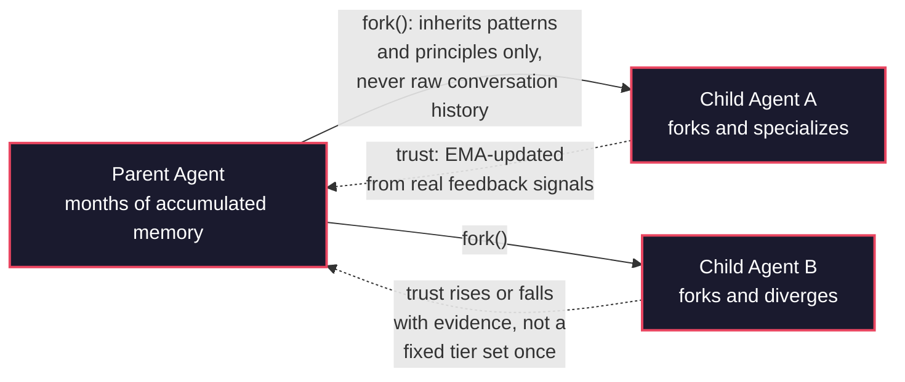
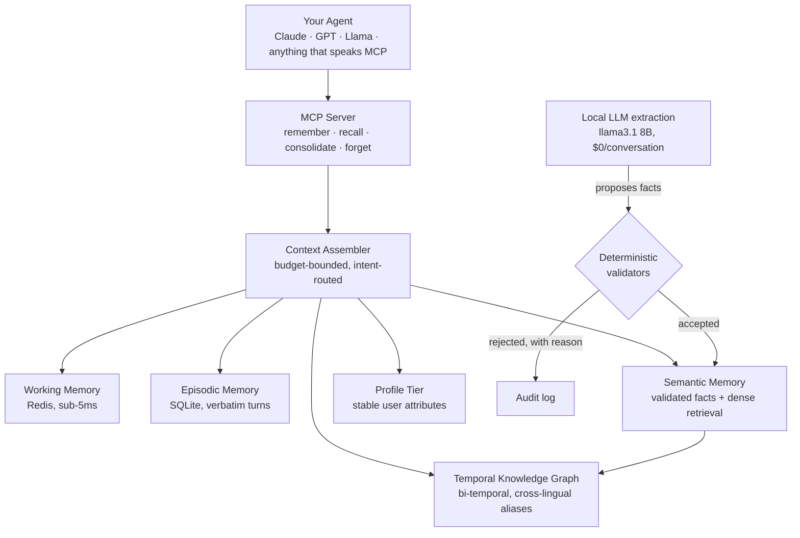

# AgentMem OS

**Memory for AI agents, in any language.**

[](https://github.com/Sahith59/AgentMem-OS/actions/workflows/ci.yml)

An open-source, local-first memory engine for LLM agents. The latest development-exposed LongMemEval `_s` run scored **423/500 (84.6%) once** with the precision-source pipeline; the preceding fixed configuration scored **418/500 (83.6%) in two repeats**. These are different configurations, and 84.6% is not yet a repeated headline. The older full-evidence Luna series scored 80.0% across three runs. The system combines verbatim conversations, validated facts, a temporal knowledge graph and agent memory forks. Cross-lingual identity and Indic evaluation are active research tracks; native Hindi/Telugu ingestion-to-recall performance is not yet established.

## Find what you need in 30 seconds

| Question | Answer |
|---|---|
| How good is it, really? | **[docs/RESULTS.md](docs/RESULTS.md)**: current 84.6% single run, 83.6% repeated predecessor, and qualified historical results |
| Every number in one table? | **[docs/RESULTS.md](docs/RESULTS.md)**: every run ever, with harness, models, tokens, and artifact |
| What failed on the way? | **[docs/FAILURES.md](docs/FAILURES.md)**: every refuted idea, what it cost, what it bought |
| Why is it built this way? | **[docs/DECISIONS.md](docs/DECISIONS.md)**: each decision with its measured outcome, good and bad |
| What about Indian languages? | **[docs/INDIC_ROADMAP.md](docs/INDIC_ROADMAP.md)**: the cross-lingual layer, measured numbers, the benchmark nobody has built |
| Can I trust vendor benchmark claims? | **[COMPETITIVE_ANALYSIS.md](COMPETITIVE_ANALYSIS.md)**: sourced claims, and why most published numbers are not comparable |
| How do I run it? | [Quickstart](#quickstart): local, free, no API key |

We publish negative results and retracted numbers alongside the wins. If that seems unusual, [docs/FAILURES.md](docs/FAILURES.md) explains why it is the point.

---

## The idea, in one diagram


```mermaid
flowchart LR
    classDef agent fill:#1a1a2e,stroke:#e94560,stroke-width:2px,color:#ffffff

    P["Parent Agent<br/>months of accumulated memory"]:::agent
    C1["Child Agent A<br/>forks and specializes"]:::agent
    C2["Child Agent B<br/>forks and diverges"]:::agent

    P -->|"fork(): inherits patterns<br/>and principles only,<br/>never raw conversation history"| C1
    P -->|"fork()"| C2
    C1 -.->|"trust: EMA-updated<br/>from real feedback signals"| P
    C2 -.->|"trust rises or falls<br/>with evidence, not a<br/>fixed tier set once"| P
```

A child never reads its parent's raw conversations, only the abstracted patterns and principles that survived generalization. Trust between any two agents starts neutral and moves with an exponentially weighted moving average of real feedback: `trust_new = 0.80 x trust_old + 0.20 x signal`. Nothing here is assigned by hand and left to rot.

---

## What's actually running underneath


```mermaid
flowchart TD
    App["Your Agent<br/>Claude · GPT · Llama · anything that speaks MCP"] --> MCP["MCP Server<br/>remember · recall · consolidate · forget"]
    MCP --> CA["Context Assembler<br/>budget-bounded, intent-routed"]

    CA --> T1["Working Memory<br/>Redis, sub-5ms"]
    CA --> T2["Episodic Memory<br/>SQLite, verbatim turns"]
    CA --> T3["Semantic Memory<br/>validated facts + dense retrieval"]
    CA --> T4["Profile Tier<br/>stable user attributes"]
    CA --> KG["Temporal Knowledge Graph<br/>bi-temporal, cross-lingual aliases"]

    X["Local LLM extraction<br/>llama3.1 8B, $0/conversation"] -->|"proposes facts"| V{"Deterministic<br/>validators"}
    V -->|"rejected, with reason"| D["Audit log"]
    V -->|"accepted"| T3
    T3 --> KG
```

Verbatim conversation evidence stays primary. A local 8B model proposes facts from each conversation and deterministic validators decide what is stored: a fact claiming a number must show that number in something the user actually said, assistant-sourced claims are rejected, and contradictions are superseded with timestamps, never silently deleted. The knowledge graph knows when a fact *stopped* being true, not just that it once existed.

---

## What makes this different

- **A benchmark record that includes failures.** We disclose the answerer, judge, split, memory source, context budget, repeat count and negative experiments. Single-run results are labelled as such. See [docs/RESULTS.md](docs/RESULTS.md) and [docs/FAILURES.md](docs/FAILURES.md).
- **Cross-lingual identity under evaluation.** An earlier hand-labelled EN/Hindi/Tamil alias set measured precision 0.762 and recall 0.533 at one operating point. That does not establish end-to-end Hindi/Telugu memory accuracy or meet the later 0.95 automatic-merge precision target. See [docs/INDIC_ROADMAP.md](docs/INDIC_ROADMAP.md).
- **Extraction that cannot hallucinate silently.** The LLM proposes; deterministic validators decide, with logged rejection reasons. 19,195 sessions extracted into 98,372 validated facts at $0 API cost.
- **Dynamic trust, not static tiers.** Trust is a live number updated from evidence. Measured in an adversarial harness: retrieval precision 0.951 with trust-weighting versus 0.625 without, and an unreliable agent's perceived trust decays 0.50 to 0.27 automatically.
- **Fork, not just share.** Child agents inherit abstracted knowledge and start with a clean episodic slate: the first formalization of git-style memory branching for LLM agents.
- **A temporal knowledge graph that doesn't lie about the past.** Bi-temporal facts (`valid_from` / `valid_until`), deterministic zero-LLM-call supersession, point-in-time queries.
- **100% local-first.** Every tier runs on your machine. Plug in Claude, GPT, or a fully local Ollama model interchangeably.

---

## Results

**Headline, LongMemEval `_s` (the hard split: ~48-session, ~115k-token haystacks per question):**

| Configuration | QA accuracy | Mean context sent |
|---|---|---|
| Precision-source pipeline, current | **84.6%** (423/500, one run; repeat pending) | 40k-character cap; mean tokens not reported |
| Prior revised pipeline | **83.6%** (418/500 in each of two repeats) | 40k-character cap; mean tokens not reported |
| Historical full-evidence Luna series | 80.0% ± 0.5 (three 500-question runs) | ~8.5k tokens |
| AgentMem OS, 24k operating point | 76.9% ± 1.0 (n=150, mean of 3 runs) | 5,698 tokens |

The English rows use different corpus and retrieval configurations. The current answerer is `gpt-5.6-luna`; the benchmark's official type-specific judge uses `gpt-4o`. See [docs/RESULTS.md](docs/RESULTS.md) for repeat counts and historical comparability limits. A 90% result has not been measured.

**Why evidence delivery matters:** historical session-coverage analysis found a large association with answer accuracy, but a session hit does not prove that its answer-bearing turn or all operands reached the packet. Later full500 audits separate retrieval gaps from answer selection, abstention and judge sensitivity. See [docs/BENCHMARKS.md](docs/BENCHMARKS.md#the-coverage-finding-the-mechanism-behind-everything) for the original analysis and [docs/RESULTS.md](docs/RESULTS.md) for the qualified current result.

**Multi-agent trust, measured in harness:**

| Configuration | Retrieval precision |
|---|---|
| Full system (dynamic trust + fork inheritance) | **0.951** |
| No trust-weighting | 0.625 |

**Cross-lingual entity resolution pilot (EN/Hindi/Tamil, hand-labelled, with adversarial negatives):** precision 0.762 / recall 0.533 at one tested threshold. It is not yet an end-to-end Indic memory result or a production-quality automatic-merge operating point. Table and design in [docs/INDIC_ROADMAP.md](docs/INDIC_ROADMAP.md).

An earlier n=30 head-to-head against Mem0, Letta, and LangMem lives with its caveats in [docs/BENCHMARKS.md](docs/BENCHMARKS.md). Historical per-question artifacts are in [`benchmarks/`](benchmarks/); later frozen-run receipts are retained in the project's evaluation memory.

---

## Quickstart

**Requirements:** Python 3.11+, Redis running locally. No API key required; runs fully offline with Ollama.

```bash
git clone https://github.com/Sahith59/AgentMem-OS.git
cd AgentMem-OS

python3 -m venv venv
source venv/bin/activate      # Windows: venv\Scripts\activate

pip install -r requirements.txt
pip install -e . --no-deps
python -m spacy download en_core_web_sm

cp .env.example .env          # optional: add ANTHROPIC_API_KEY / OPENAI_API_KEY for hosted models

python -c "from agentmem_os.db.engine import init_db; init_db()"
```

```python
import uuid
from agentmem_os.storage.store import ConversationStore
from agentmem_os.llm.context_assembler import ContextAssembler

session_id = f"demo-{uuid.uuid4().hex[:8]}"   # fresh session; memory persists
                                                # across restarts as long as you
                                                # reuse the same session_id
store = ConversationStore()
store.save_turn(session_id, role="user", content="I'm building a rover for a robotics competition.")

assembler = ContextAssembler()
context = assembler.assemble(session_id, query="What am I building?")
print(context)   # correctly recalls the rover, days or months later
```

Or connect any MCP-compatible agent (Claude Desktop, your own LangGraph pipeline) directly. See [`mcp_server/`](mcp_server/) for the 6 exposed tools across both supported transports.

---

## Architecture, in code

```
agentmem_os/
├── agents/                    # Multi-agent memory federation
│   ├── memory_federation.py   #   promote → retrieve → feedback → decay
│   ├── namespace_manager.py   #   fork(), merge_patterns(), lineage tracking
│   └── trust_network.py       #   dynamic EMA trust, transitive propagation
├── api/                       # FastAPI REST interface
├── benchmarks/
│   ├── adapters/               #   Real adapters: Mem0, Graphiti, Letta, LangMem
│   ├── qa_accuracy_eval.py     #   The LongMemEval harness (preflights, provenance)
│   ├── mfp_eval.py             #   Multi-agent federation eval, real code paths
│   └── cross_lingual_kg_eval.py #  Cross-lingual entity resolution, measured
├── cache/                      # Tier 1: Redis working memory
├── cli/                        # Typer CLI
├── db/
│   ├── knowledge_graph.py      # Temporal Knowledge Graph (bi-temporal, NetworkX)
│   ├── entity_aliases.py       # Cross-lingual ALIAS_OF edges (measured τ=0.90)
│   └── models.py               # Turn, Session, SemanticFact, ProfileAttribute, ...
├── llm/
│   ├── consolidation_v2.py     # Extraction + validators + supersession pipeline
│   ├── context_assembler.py    # Budget-bounded retrieval across all tiers
│   └── profile_extractor.py    # Stable-attribute projection from facts
├── mcp_server/                  # MCP server: 6 tools, 2 transports
├── memory/
│   └── conflict_detector.py     # Zero-LLM-call contradiction detection
├── storage/
│   └── store.py                 # Coordinates all tiers
└── tests/                       # 125+ tests, real code paths
```

---

## Configuration

```yaml
# config.yaml
models:
  default_model: "ollama/llama3.1"        # fully local, no API key
  fallback_model: "anthropic/claude-haiku-4-5-20251001"
  compression_threshold: 0.70              # trigger consolidation at 70% context
```

| Model | String | Use case |
|---|---|---|
| Llama 3.1 (local) | `ollama/llama3.1` | Free, fully offline |
| Claude Haiku | `anthropic/claude-haiku-4-5-20251001` | Cheap hosted option |
| Claude Sonnet | `anthropic/claude-sonnet-4-6` | Best quality |
| Groq Llama | `groq/llama-3.1-8b-instant` | Free hosted fallback |

Cross-lingual entity aliasing (optional: `pip install -e ".[multilingual]"`):

| Env var | Default | Meaning |
|---|---|---|
| `AGENTMEM_OS_CROSS_LINGUAL` | `1` | Set `0` to disable even when installed |
| `AGENTMEM_OS_CROSS_LINGUAL_TAU` | `0.90` | Measured F1-optimal; `0.95` = zero measured false positives, much lower recall |

---

## Research

The Memory Federation Protocol (dynamic EMA trust and confidence-decayed parent-child forking) is the subject of an in-progress paper targeting [AAMAS 2027](https://warwick.ac.uk/fac/sci/dcs/aamas2027/calls/). Everything the paper claims traces to a committed script, a raw result file, and a fixed seed in this repository. Nothing is asserted without a reproducible number behind it.

---

## Contributing

Issues and PRs welcome. If you're comparing this against another memory system and find a gap in the comparison, or a case where this one is wrong, please open an issue. The benchmark harness is designed to be re-run and argued with, not taken on faith. Corrections that move this project *down* a table get published too; [docs/FAILURES.md](docs/FAILURES.md) is the proof of that habit.

---

## License

MIT. See `LICENSE`.
