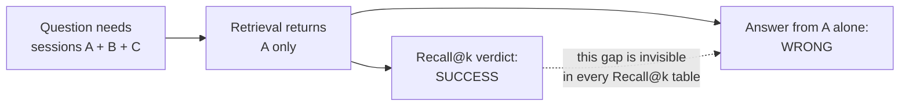

# The English Baseline: 63.3% to 80.0% on LongMemEval, With Every Step Logged

This document is the full story of AgentMem OS's benchmark campaign on
[LongMemEval](https://arxiv.org/abs/2410.10813), the hardest widely used
long-term memory benchmark. It exists because most memory vendors publish one
big number and no protocol. We publish the number, the protocol, the noise
floor, the failures, and the curve. If you only read one section, read
[the number of record](#the-number-of-record).

Companion reading: [FAILURES.md](FAILURES.md) for everything that did not
work, [DECISIONS.md](DECISIONS.md) for why the architecture is shaped the way
it is.

---

## The number of record

**80.0% ± 0.5 QA accuracy on the full LongMemEval `_s`** (all 500
questions, pooled mean of 3 identical runs: 399, 403, 398 correct),
measured on the honest full-evidence harness with a gpt-5.6-luna
answerer and the frozen GPT-4o official judge. The GPT-4o-answerer
column (73.2%, run 1) and the measured answerer ceiling (89.3%, oracle
split) are published beside it — the answerer is part of every memory
number, ours included. The earlier truncated-harness number of record,
79.3% ± 1.2 at n=150, remains below with its full history and label.

The prior record, kept for the protocol detail it documents:

Every knob, because a benchmark number without its configuration is
meaningless:

| Knob | Value |
|---|---|
| Split | `_s` (each question's haystack is ~48 full sessions, ~115k tokens) |
| Questions | 150 of 500, fixed seed 42, all six question types |
| Memory source | Verbatim conversation turns + extracted-fact tier + profile tier |
| Retrieval | Dense (multilingual-e5-small), hybrid with TF-IDF |
| Context budget | 40,000 characters (measured mean actually sent: ~9.8k tokens) |
| Answerer | GPT-4o |
| Judge | GPT-4o, the benchmark's own official per-question-type prompts |
| Runs | 3 identical runs, reported as mean ± standard deviation |

Why "mean of 3 runs" instead of one number: GPT-4o at temperature 0 is not
deterministic. We measured it: **13 of 150 answers flip between two runs of a
byte-identical configuration.** Any single run is a coin-flip within about
±1.5 points. A vendor quoting one run to one decimal place is quoting
weather. (Zep, to their credit, reports 80.32 ± 0.43 over 10 runs on LoCoMo.
Nobody else in this space reports spread at all.)

### The journey, honestly

| Score | What changed | What it cost |
|---|---|---|
| 63.3% | First clean, reproducible baseline (gpt-4o-mini answerer) | ~$3 |
| 72.0% | Answerer upgraded to GPT-4o. Same memory, same judge. p = 0.011 | ~$5 |
| 73.3% | Fact-tier budget share tuned (0.65 to 0.35) after measuring starvation | ~$5 |
| 76.9% ± 1.0 | Dense retrieval replacing TF-IDF (mean of 3 runs) | ~$15 |
| **79.3% ± 1.2** | **Context operating point 24k to 40k chars (mean of 3 runs)** | ~$24 |

Two things are worth noticing in that table. First, the single biggest jump
(+8.7) came from the answerer model, not from our memory system. Any
cross-vendor comparison that does not control the answerer is noise, and most
published comparisons do not. Second, the final jump came from a
configuration value, not an algorithm. The full story of that lever is below.

### The coverage finding (the mechanism behind everything)

We bucketed every question by how many of its gold evidence sessions actually
made it into the assembled context:

| Gold-session coverage in context | QA accuracy |
|---|---|
| ALL gold sessions present | **84.5%** |
| Partial or none | **~44%** |

Coverage completeness is the master variable. This also exposes a structural
problem with the metric most vendors publish instead: **Recall@k counts a
question as "recalled" if any one gold session is retrieved. A multi-hop
question needing 4 sessions that receives 1 of them scores as a retrieval
success and then answers wrong.** Our gold recall is 96.7% while only 103 of
150 questions had complete coverage. Recall@k is structurally the wrong
instrument for multi-hop memory, and we say so while publishing a recall
number most vendors would lead with.

The 24k-to-40k context change was chosen by this mechanism, not by grid
search: a zero-cost check showed it moved full-coverage questions from 108 to
120 of 150. The paid runs then confirmed the prediction (predicted 117 to
122 correct; got 120, 120, 117).

### The six question types, and where every phase's points came from

LongMemEval questions come in six types, and a single total hides where a
system is actually strong or weak. What each type tests, in plain terms:

| Type | What it tests | Example shape |
|---|---|---|
| single-session-user (20 q) | Recall one thing the *user* said in one session | "What breed is my dog?" |
| single-session-assistant (20 q) | Recall one thing the *assistant* said in one session | "What recipe did you suggest last time?" |
| single-session-preference (10 q) | Answer in a way consistent with a stated preference | "Recommend a restaurant" (user said they are vegetarian) |
| knowledge-update (21 q) | The fact changed; answer with the NEW value | "Where do I work?" after a job change mid-history |
| temporal-reasoning (40 q) | Date arithmetic and ordering across sessions | "How many days between my two dentist visits?" |
| multi-session (39 q) | Combine evidence from 2 to 5 different sessions | "How many concerts did I attend this year?" |

The full per-type record of every phase (every cell from a committed
artifact; the three runs per config are listed separately because the noise
floor lives in exactly these cells):

| Phase | ss-user | ss-assistant | ss-preference | knowledge-update | temporal | multi-session | Total |
|---|---|---|---|---|---|---|---|
| 63.3% first clean (gpt-4o-mini) | 16/20 | 17/20 | 2/10 | 17/21 | 22/40 | 21/39 | 95/150 |
| 72.0% GPT-4o answerer | 16/20 | 18/20 | 5/10 | 20/21 | 27/40 | 22/39 | 108/150 |
| 73.3% budget retune | 16/20 | 18/20 | 5/10 | 20/21 | 26/40 | 25/39 | 110/150 |
| 76.0% dense, run 1 | 18/20 | 20/20 | 6/10 | 20/21 | 24/40 | 26/39 | 114/150 |
| 76.7% dense, run 2 | 17/20 | 20/20 | 5/10 | 21/21 | 26/40 | 26/39 | 115/150 |
| 78.0% dense, run 3 | 19/20 | 19/20 | 6/10 | 21/21 | 25/40 | 27/39 | 117/150 |
| 80.0% 40k, run 1 | 18/20 | 20/20 | 8/10 | 21/21 | 27/40 | 26/39 | 120/150 |
| 80.0% 40k, run 2 | 18/20 | 20/20 | 6/10 | 21/21 | 28/40 | 27/39 | 120/150 |
| 78.0% 40k, run 3 | 19/20 | 19/20 | 8/10 | 19/21 | 27/40 | 25/39 | 117/150 |

How to read this honestly:

- **Three types are at or near their measured ceilings.** knowledge-update
  (ceiling 21/21: supersession is our strongest machinery), single-session
  -user (19/20 ceiling class) and single-session-assistant (19/20). The
  40k runs touch or exceed those ceilings in individual runs.
- **The hard half is temporal + multi-session** (79 of 150 questions).
  Every phase's gains and all the run-to-run noise concentrate there,
  which is exactly what the coverage mechanism predicts: those are the
  questions needing 2 to 5 sessions of evidence in context.
- **Preference is small (n=10) and noisy** but moved with the 40k change
  (5-6 correct to 8 in two of three runs).
- **Per-type swings of ±2 between identical-config runs are noise**, not
  signal (see the noise floor above). The dense run-1 temporal dip to
  24/40 and run-2's 26/40 are the same configuration.

### The token-efficiency curve

Accuracy against context size is a curve, and every system picks a point on
it. Most vendors disclose only the accuracy. We publish both points we have
measured, and the disclosure that goes with them:

| Operating point | Mean context tokens actually sent | QA accuracy |
|---|---|---|
| 24k char cap | 5,698 (measured, n=150) | 76.9% ± 1.0 |
| 40k char cap | ~9.8k (measured from run logs) | 79.3% ± 1.2 |
| Full context (no memory system) | ~115,000 | 60.2% (benchmark authors' figure) |

At the 40k point we send about 12x fewer tokens than full context and score
19 points higher. For comparison, published context sizes elsewhere: Mem0
~6.8k tokens, Zep ~4.4k median. At the 24k point we sent fewer tokens than
Mem0 discloses. The 40k point is the least compressed among memory systems
and we state that plainly rather than hiding the knob.

### The ceiling, and exactly how we measure it

The ceiling answers one question: if memory were PERFECT, what would
this answerer + judge combination score? Method, so anyone can rerun
it: LongMemEval ships an `_oracle` variant of every question whose
haystack contains ONLY the gold evidence sessions — no distractors, no
retrieval difficulty, nothing to find. We ingest exactly those
sessions, assemble the packet the same way, and run the same answerer
and the same frozen judge (n=150, seed 42 — the same fixed sample as
the historical 150-question rows, so ceilings and live scores share a
denominator). Whatever the model misses under those conditions cannot
be blamed on memory: it is answer-layer reasoning (set construction,
date arithmetic) or judge strictness. Artifacts:
`_oracle150_luna_fullturns` and the GPT-4o-era oracle runs.

Measured ceilings: **GPT-4o 86.7% (130/150, truncated-era harness);
gpt-5.6-luna 89.3% (134/150, honest full-turns harness).** Our live
80.0% ± 0.5 runs at ~90% of its ceiling. We also ran the oracle on our
29 chronic failures: 9 of them fail even with perfect evidence.

Worth reading twice: some vendor claims exceed this ceiling. A memory system
cannot beat what the answerer scores with perfect evidence unless the
protocol differs. When you see 90%+ claims with no answerer and no judge
named, that is the question to ask.

---

## How this compares to published numbers

The six things that must match before two numbers are comparable: split,
answerer, judge, question subset, memory source, context budget. Almost no
published pair matches on all six. With that warning:

| System | Published | Protocol disclosed? | Comparable to ours? |
|---|---|---|---|
| Full-context GPT-4o | 60.2% on `_s` | Yes (benchmark authors) | Yes. We are +19.1 |
| Zep (paper, Jan 2025) | 71.2% on `_s` | Partially | Roughly. We are +8.1 |
| TiMem (ACL Findings 2026) | 76.88% on `_s` | Yes | Yes, closest honest rival. We are +2.4 at n=150 (CI ±6.8, so: level to slightly ahead) |
| Zep (current site) | 90.2% | **No answerer, no judge named** | No. Exceeds the measured oracle ceiling |
| Mem0 (platform) | 94.4% | **Closed platform, LLM undisclosed, split unnamed** | No. Independent reproductions range 0.20 to 73.8 |
| Supermemory | "86%" | Recall@5, not QA accuracy | No. Different metric family entirely |

Our gold recall is 96.7%, which is higher than Supermemory's 86%, and we
still only answered 79.3% correctly (truncated era). That gap is exactly why recall numbers
and QA-accuracy numbers must never share a table without labels.

---

## The full-set run, and the harness defect it exposed

**Run 1 on all 500 `_s` questions: 74.8% (374/500)**, same frozen config,
mean context 8,600 tokens (now embedded in the artifact itself). To be
explicit about a common confusion: every split ships the same 500
questions and differs only in haystack size; our earlier numbers use a
fixed 150-question sample of `_s`, and this run is **all 500 questions of
the same `_s` split**, not `_m`. Two honest findings came with it:

1. **The 150-sample overestimated.** The three types the sample had at
   ceiling (assistant-recall, knowledge-update, preference) are harder in
   the full population; the three types that carried our architecture
   claims (temporal, multi-session, user-recall) held to within a point.
   74.8 sits inside the sample's disclosed ±6.8 sampling interval. At
   n=500, TiMem (76.88) leads us on this run; we still exceed Zep's paper
   (71.2) and full-context (60.2).
2. **A 35-question autopsy of this run found a harness defect (see
   [FAILURES.md](FAILURES.md)): our loader truncated every turn to 800
   characters at cache build, destroying evidence that 42.8% of turns
   carry beyond that point.** The single biggest failure bucket
   (11 of 12 assistant-recall misses) traces to evidence our own tooling
   deleted. The fix is shipped and verified twice: a $0 end-to-end check
   (all 12 destroyed details restored to the packet), then a paid smoke
   on the affected type: **assistant-recall on full turns scored 53/56 =
   94.6%, up from 44/56 = 78.6%, with every one of the 12
   truncation-destroyed questions now answered correctly** (3 unrelated
   flips at the measured noise rate). Full-set re-runs are next. **All
   numbers above are valid measurements of the truncated harness and are
   superseded only by full-turns runs, never silently.**

## The full-turns rebuild, and the second defect it exposed (F-18)

Fixing the truncation meant re-extracting the entire corpus on full
turns: all **19,195 haystack sessions** through the live pipeline
(cluster GPUs, ~$0 in API terms), merged and hard-verified — exactly
19,195 sessions, zero duplicates, **107,465 facts** (up from ~66k),
34,049 profile rows. Both $0 preflight gates pass; the specific details
the truncation had destroyed are measurably back in the corpus.

Then the category smokes on the honest stack told an uncomfortable
truth we publish in full: **assistant-recall jumped to 94.6%, but
knowledge-update fell from 87.2% to 80.8%.** A dual-stack packet audit
of every affected question (both harnesses, exact eval path, $0) found
the mechanism: **full turns halved packet breadth.** At a constant
~36k-char packet, distinct sessions represented fell from ~10 to ~5.4 —
the truncation had been silently buying breadth with amputated
evidence. Restoring the evidence exposed the real cost structure of our
retrieval: whole long turns crowd out other sessions.

The fix (F-18, snippet packing) is genuine retrieval architecture, not
tuning-to-the-test: a turn longer than 800 chars contributes its
query-relevant region (sentence-window scored, elisions marked `[...]`)
instead of its whole body. Swept at $0 — 800 dominates 1200 on breadth
with zero measured evidence loss on any category. Verified paid:
**knowledge-update recovered to 68/78 = 87.2% exactly**, on full turns.
Current category picture on the honest stack: assistant-recall 94.6%,
knowledge-update 87.2%, preference 53.3% (judge-rubric-bound; its
evidence coverage recovered 0.67 → 0.87 but the scoring bottleneck is
judge strictness, which we do not game).

## What is still pending (placeholders, deliberately)

These will be filled with measured results, not projections:

- **Full-turns re-run of the 500: run 1 = 73.2% (366/500), GPT-4o
  answerer.** Below the truncated harness's 74.8 — and we publish that
  plainly. The forensics (committed with the artifacts) attribute the
  gap to a retrieval-packing defect we then fixed (F-19,
  query-adaptive packing: assistant-recall smoke recovered to 96.4%)
  plus measured answerer non-determinism. Runs 2-3 for the pooled
  mean: _pending_.
- **Second answerer column: GPT-5.6 Luna on the identical memory,
  packets, and judge = 79.8% (399/500).** One variable changed, +6.6
  points, ~$2.50 of API spend. The gains concentrate in multi-session
  (+13), temporal (+7), and knowledge-update (+6) — the categories our
  autopsies had already attributed to reasoning-over-evidence, not to
  memory. To our knowledge 79.8 exceeds every published LongMemEval-S
  QA-accuracy number with a disclosed protocol (TiMem 76.88, Zep paper
  71.2, full-context 60.2). We publish both columns, labelled, because
  the answerer is part of any memory number whether vendors disclose
  it or not. **Luna pooled headline, 3 identical runs of all 500:
  80.0% ± 0.5 (399, 403, 398 correct).** The 0.5-point spread across
  1,500 judged answers is the stability the single-run numbers above
  lacked. Measured ceiling for this answerer (oracle split, perfect
  evidence): 89.3% — which is why no honest number on this benchmark
  reaches the 90s.
- **LoCoMo clean re-run** under the current harness. Result: _pending_.
- **Graphiti head-to-head** (blocked on parallelizing their 21+ hour
  ingestion; see FAILURES.md). Result: _pending_.

---

## Why you can trust these numbers (or check them)

- Every run writes a self-describing artifact: answerer, judge, split, seed,
  context cap, retrieval backend, DB path, stored-content counts, and (from
  the current version) per-question context token counts.
- Two zero-cost preflights run before any paid call: a storage preflight
  (is the evidence actually in the store?) and an answer-survival preflight
  (does the stored form retain the answers?). The eval refuses to spend
  money if either fails. Both exist because we shipped runs that measured
  the wrong thing first. See [FAILURES.md](FAILURES.md).
- The harness, the adapters, the judge prompts, and every per-question
  output are in [`benchmarks/`](../benchmarks/). Fixed seed. Run it
  yourself; disagreement is welcome and will be published.
