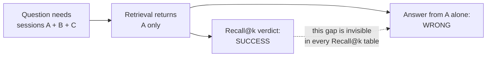

# The English Baseline: 63.3% to 79.3% on LongMemEval, With Every Step Logged

This document is the full story of AgentMem OS's benchmark campaign on
[LongMemEval](https://arxiv.org/abs/2410.10813), the hardest widely used
long-term memory benchmark. It exists because most memory vendors publish one
big number and no protocol. We publish the number, the protocol, the noise
floor, the failures, and the curve. If you only read one section, read
[the number of record](#the-number-of-record).

Companion reading: [FAILURES.md](FAILURES.md) for everything that did not
work, [DECISIONS.md](DECISIONS.md) for why the architecture is shaped the way
it is.

---

## The number of record

**79.3% ± 1.2 QA accuracy on LongMemEval `_s`** (150 questions, pooled mean
of 3 identical runs: 120, 120, 117 of 150 correct).

Every knob, because a benchmark number without its configuration is
meaningless:

| Knob | Value |
|---|---|
| Split | `_s` (each question's haystack is ~48 full sessions, ~115k tokens) |
| Questions | 150 of 500, fixed seed 42, all six question types |
| Memory source | Verbatim conversation turns + extracted-fact tier + profile tier |
| Retrieval | Dense (multilingual-e5-small), hybrid with TF-IDF |
| Context budget | 40,000 characters (measured mean actually sent: ~9.8k tokens) |
| Answerer | GPT-4o |
| Judge | GPT-4o, the benchmark's own official per-question-type prompts |
| Runs | 3 identical runs, reported as mean ± standard deviation |

Why "mean of 3 runs" instead of one number: GPT-4o at temperature 0 is not
deterministic. We measured it: **13 of 150 answers flip between two runs of a
byte-identical configuration.** Any single run is a coin-flip within about
±1.5 points. A vendor quoting one run to one decimal place is quoting
weather. (Zep, to their credit, reports 80.32 ± 0.43 over 10 runs on LoCoMo.
Nobody else in this space reports spread at all.)

### The journey, honestly

| Score | What changed | What it cost |
|---|---|---|
| 63.3% | First clean, reproducible baseline (gpt-4o-mini answerer) | ~$3 |
| 72.0% | Answerer upgraded to GPT-4o. Same memory, same judge. p = 0.011 | ~$5 |
| 73.3% | Fact-tier budget share tuned (0.65 to 0.35) after measuring starvation | ~$5 |
| 76.9% ± 1.0 | Dense retrieval replacing TF-IDF (mean of 3 runs) | ~$15 |
| **79.3% ± 1.2** | **Context operating point 24k to 40k chars (mean of 3 runs)** | ~$24 |

Two things are worth noticing in that table. First, the single biggest jump
(+8.7) came from the answerer model, not from our memory system. Any
cross-vendor comparison that does not control the answerer is noise, and most
published comparisons do not. Second, the final jump came from a
configuration value, not an algorithm. The full story of that lever is below.

### The coverage finding (the mechanism behind everything)

We bucketed every question by how many of its gold evidence sessions actually
made it into the assembled context:

| Gold-session coverage in context | QA accuracy |
|---|---|
| ALL gold sessions present | **84.5%** |
| Partial or none | **~44%** |

Coverage completeness is the master variable. This also exposes a structural
problem with the metric most vendors publish instead: **Recall@k counts a
question as "recalled" if any one gold session is retrieved. A multi-hop
question needing 4 sessions that receives 1 of them scores as a retrieval
success and then answers wrong.** Our gold recall is 96.7% while only 103 of
150 questions had complete coverage. Recall@k is structurally the wrong
instrument for multi-hop memory, and we say so while publishing a recall
number most vendors would lead with.

The 24k-to-40k context change was chosen by this mechanism, not by grid
search: a zero-cost check showed it moved full-coverage questions from 108 to
120 of 150. The paid runs then confirmed the prediction (predicted 117 to
122 correct; got 120, 120, 117).

### The token-efficiency curve

Accuracy against context size is a curve, and every system picks a point on
it. Most vendors disclose only the accuracy. We publish both points we have
measured, and the disclosure that goes with them:

| Operating point | Mean context tokens actually sent | QA accuracy |
|---|---|---|
| 24k char cap | 5,698 (measured, n=150) | 76.9% ± 1.0 |
| 40k char cap | ~9.8k (measured from run logs) | 79.3% ± 1.2 |
| Full context (no memory system) | ~115,000 | 60.2% (benchmark authors' figure) |

At the 40k point we send about 12x fewer tokens than full context and score
19 points higher. For comparison, published context sizes elsewhere: Mem0
~6.8k tokens, Zep ~4.4k median. At the 24k point we sent fewer tokens than
Mem0 discloses. The 40k point is the least compressed among memory systems
and we state that plainly rather than hiding the knob.

### The ceiling

Hand GPT-4o the gold evidence directly, no retrieval at all, same judge:
**86.7% (130/150).** That is the practical maximum any memory system can
reach on this data, answerer, and judge. We are at 91% of ceiling. The
remaining errors are answer-layer reasoning (set construction, date
arithmetic), not retrieval, and we know because we ran the oracle on the
systematic failures: 9 of 29 fail even with perfect evidence.

Worth reading twice: some vendor claims exceed this ceiling. A memory system
cannot beat what the answerer scores with perfect evidence unless the
protocol differs. When you see 90%+ claims with no answerer and no judge
named, that is the question to ask.

---

## How this compares to published numbers

The six things that must match before two numbers are comparable: split,
answerer, judge, question subset, memory source, context budget. Almost no
published pair matches on all six. With that warning:

| System | Published | Protocol disclosed? | Comparable to our 79.3? |
|---|---|---|---|
| Full-context GPT-4o | 60.2% on `_s` | Yes (benchmark authors) | Yes. We are +19.1 |
| Zep (paper, Jan 2025) | 71.2% on `_s` | Partially | Roughly. We are +8.1 |
| TiMem (ACL Findings 2026) | 76.88% on `_s` | Yes | Yes, closest honest rival. We are +2.4 at n=150 (CI ±6.8, so: level to slightly ahead) |
| Zep (current site) | 90.2% | **No answerer, no judge named** | No. Exceeds the measured oracle ceiling |
| Mem0 (platform) | 94.4% | **Closed platform, LLM undisclosed** | No. Independent reproductions range 0.20 to 73.8 |
| Supermemory | "86%" | Recall@5, not QA accuracy | No. Different metric family entirely |

Our gold recall is 96.7%, which is higher than Supermemory's 86%, and we
still only answer 79.3% correctly. That gap is exactly why recall numbers
and QA-accuracy numbers must never share a table without labels.

---

## What is still pending (placeholders, deliberately)

These will be filled with measured results, not projections:

- **Full 500-question `_s` run, 3 repetitions, mean ± spread.** The
  publishable headline at the scale vendors publish at. Infrastructure is
  ready (the full 19,195-session haystack is extracted and preflighted).
  Result: _pending_.
- **Second answerer column.** Same memory, same judge, a second frontier
  model, to show the answerer effect explicitly. Result: _pending_.
- **LoCoMo clean re-run** under the current harness. Result: _pending_.
- **Graphiti head-to-head** (blocked on parallelizing their 21+ hour
  ingestion; see FAILURES.md). Result: _pending_.

---

## Why you can trust these numbers (or check them)

- Every run writes a self-describing artifact: answerer, judge, split, seed,
  context cap, retrieval backend, DB path, stored-content counts, and (from
  the current version) per-question context token counts.
- Two zero-cost preflights run before any paid call: a storage preflight
  (is the evidence actually in the store?) and an answer-survival preflight
  (does the stored form retain the answers?). The eval refuses to spend
  money if either fails. Both exist because we shipped runs that measured
  the wrong thing first. See [FAILURES.md](FAILURES.md).
- The harness, the adapters, the judge prompts, and every per-question
  output are in [`benchmarks/`](../benchmarks/). Fixed seed. Run it
  yourself; disagreement is welcome and will be published.
