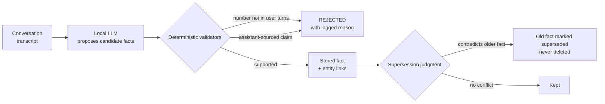

# Architectural Decisions: What We Chose, Why, and How It Turned Out

Every consequential decision in AgentMem OS, with the reasoning at the time
and the measured outcome afterwards. Decisions that turned out badly are
marked as such. The point of this page is that you should be able to
disagree with us precisely.

---

## D1. Extraction proposes, deterministic validators decide

**The decision.** The LLM that reads a conversation may only *propose*
candidate facts. Deterministic code decides what is stored: a fact claiming
a number must show that number in something the user actually said; a fact
sourced from the assistant's own words (rather than the user's) is rejected;
contradictions are judged and superseded, never silently deleted.

**Why.** An LLM that can silently delete or corrupt a user's true memory is
unshippable. The field has a cautionary tale: a shipped memory-update
mechanism that wrongly deleted user memories and was subsequently removed,
its successor being add-only.

**Outcome: positive, measurably.** In the full-corpus extraction run
(19,195 sessions) the validators rejected thousands of candidate facts with
logged reasons. Live examples from the logs: a fact claiming a "4-5 hour"
cook time was rejected because no user turn contained those numbers (the
assistant had said them). This is the layer that makes a small local
extraction model safe to use.

## D2. Local extraction (llama3.1 8B), not a paid API

**The decision.** All fact extraction runs on a local 8B model.

**Why.** We benchmarked local models against a paid API extractor on
number-preservation before committing: llama3.1 scored 91.2% parity. The
quality gap was small; the cost gap is unbounded (a paid call per
conversation, forever, versus zero).

**Outcome: positive.** Extraction of the full benchmark corpus (19,195
sessions, 98,372 validated facts) cost $0 in API fees. It also makes the
privacy story real: transcripts never leave the machine. The measured
per-session rate is ~31s on a laptop and ~5.7s on a single A40 GPU.

## D3. Verbatim evidence is primary; extracted facts augment it

**The decision.** The context handed to the answerer leads with verbatim
conversation excerpts; the fact tier and profile tier are bounded additions
(35% and 15% budget shares).

**Why.** Measured catastrophe: replacing verbatim turns with extracted
summaries cost 43.8 accuracy points (see [FAILURES.md](FAILURES.md)). And
the budget shares exist because we measured the fact tier consuming 99 to
100% of the shared budget when unbounded, starving the evidence that
actually carries answers.

**Outcome: positive, with an honest caveat.** The caveat: at the current
English benchmark, the fact tier's net accuracy contribution measures near
zero (it wins some questions and loses others). It stays because (a) it is
the substrate the cross-lingual layer builds on, and (b) profile and fact
tiers are what make the system a memory product rather than a retrieval
demo. We say this plainly instead of claiming every tier moves the number.

## D4. The context operating point is a disclosed knob, not a hidden one

**The decision.** Context budget 40,000 characters (~10k tokens), raised
from a legacy 24,000 after a measured coverage analysis, with the measured
mean tokens per question (~9.8k) embedded in every result artifact.

**Why.** Multi-hop questions need 2 to 5 full sessions of evidence. At 24k,
only 77% of multi-session questions could even fit all their gold sessions;
at 40k, 90%+. The operating point is the cheapest coverage there is, and
coverage completeness is the measured master variable (84.5% accuracy with
full coverage versus ~44% without).

**Outcome: positive.** +2.4 points pooled mean (76.9 to 79.3), confirmed
across 3 runs, landing inside the pre-registered prediction. Every system
picks a point on the accuracy-versus-tokens curve; the difference is we
publish ours.

## D5. Config-scoped evaluation databases and refuse-to-spend preflights

**The decision.** Every eval configuration gets its own content-addressed
database; two zero-cost preflights (storage integrity, answer survival) run
before any paid API call and abort the run on failure.

**Why.** Both exist because their absence burned us: runs that shared a
mutating database were unreproducible, and a mislabeled memory source
produced a headline number that had to be retracted internally.

**Outcome: positive, twice over.** The preflight paid for itself the same
week it was extended: it blocked a ~$27 run whose fact corpus silently
covered only 30% of the required sessions. The failed preflight was the
system working.

## D6. Negative results ship as opt-in code, not deleted branches

**The decision.** Ideas that failed their pre-registered bars (breadth-then-
depth retrieval, aggregation routing, the structured answerer) remain in the
codebase behind explicit opt-in flags, with their measured results in the
docs.

**Why.** Deleted failures get rebuilt by the next person with the same idea.
Documented, opt-in failures are institutional memory. The unit tests they
left behind (deterministic date windows, dedup, unit selection) are kept
assets.

**Outcome: positive for velocity.** At least two ideas were re-proposed
internally and settled in minutes by pointing at the logged refutation.

## D7. Dynamic trust and fork-inheritance for multi-agent memory

**The decision.** Trust between agents is a live number updated by an
exponentially weighted moving average of feedback. Child agents fork a
parent's abstracted knowledge (never raw history) and diverge.

**Why.** The credible alternative in the field is manually assigned static
trust tiers. Static tiers rot; evidence does not.

**Outcome: positive in harness, unproven in production.** Measured in a
controlled adversarial scenario: trust-weighted retrieval precision 0.951
versus 0.625 without; an unreliable agent's perceived trust decays 0.50 to
0.27 with no manual intervention. Production validation is future work and
we label it as such.

## D8. Benchmark discipline as architecture

**The decision.** Rules that govern every number we publish: means over at
least 3 runs with spread; six knobs disclosed or the number is void; recall
and QA accuracy never share an unlabeled table; predictions pre-registered
before paid runs; ceilings measured before claims.

**Why.** We measured a 13-of-150 answer flip rate between identical runs,
a 28-point swing from split choice alone, and vendor claims that exceed the
physically measurable ceiling. The discipline is not virtue signaling; it is
what stops us from fooling ourselves first.

**Outcome.** Slower headline growth than cherry-picking would give, and
several retracted-before-publishing numbers. We consider that the point.
