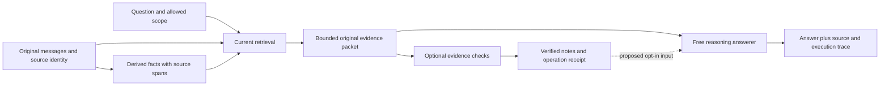

# English architecture decision — October 4, 2026

Status: architecture proposal and scoped audit. Only the provider-error diagnostics described below are implemented by this change. The proposed evidence-selection design has no measured accuracy result and is not enabled in the benchmark or product.

The verified English result remains **423/500 (84.6%) once**, with the preceding configuration at **418/500 (83.6%) twice**. Reaching 90% requires 27 net additional correct answers over 423; exceeding 90% requires 28. A selected diagnostic score cannot establish that improvement on the full population.

The completed150-case screen gives84→92, net+8, below the fixed+15 gate; current misses net+10 also misses the+12 gate. All integrity checks pass. This candidate is not promoted to full500. All18 changed grades were source-reviewed: one likely judge false positive and two source/category ambiguities qualify the gains. Among55 prior misses still wrong,32 involve aggregation/amount and13 temporal/update, using prior audit labels. See the [compact result](../benchmarks/audits/english-combined-answer-2026-10-04/result.json).

## Findings, in priority order

1. **High — evidence selection and semantic completeness remain unresolved.** The authoritative 77-miss audit finds 25 cases with every exact annotated turn present, 11 evidence-sufficiency/abstention cases, 2 extraction-lineage gaps, 10 cases with linked facts absent from the packet, and 29 cases whose linked facts are delivered while exact raw turns are missing. A citation proves origin, not that the fact preserves the needed value, entity or time. See [the reproducible stage audit](../benchmarks/audit_english_failure_stages.py) and [results history](RESULTS.md). The current query ranking in [fact_retrieval.py](../llm/fact_retrieval.py) is lexical plus entity recall; it does not certify operand completeness.
2. **High — prior structured answering already failed.** The August 12 history records 57.3% and 65.3% for two structured-answer variants, with substantial stable-answer losses. Wrong event membership, missing values and unit confusion survived deterministic arithmetic. [structured_answer.py](../benchmarks/structured_answer.py) still defaults missing counts to one and infers output units from words in the question. It remains an opt-in historical artifact. This audit does not promote it or establish that those lines caused every historical miss. See `DECISION_AND_FAILURE_LOG.md`, section 3.1af. The October 1 question-specific excerpt index also failed relevance review despite correct source offsets. Do not repeat either design under a new name.
3. **High — a provider error class is insufficient to recover correctly.** The combined screen stopped twice on `RateLimitError` without a saved provider error code. Both outputs are preserved; the error type alone cannot establish whether pacing or credits caused the rejection. The repository screen runner now saves bounded, allowlisted metadata and still stops without retry or releasing its reservation. The active frozen experiment files are preserved. [OpenAI error documentation](https://developers.openai.com/api/docs/guides/error-codes) distinguishes quota/spend failures from request throttling. Credit top-up was user-reported; successful subsequent requests establish restored access, not an independently verified account balance.
4. **High — the 500 cases are development-exposed.** Their outcomes have informed several changes. Repeats measure stability on that population; they do not make it a sealed generalization test. Any research claim about a better general memory system needs an additional sealed English evaluation. Its labels and errors must stay outside development selection.
5. **Medium — entrypoints have different execution contracts.** [qa_accuracy_eval.py](../benchmarks/qa_accuracy_eval.py) has a legacy retry loop and optional structured-to-reasoning fallback; the frozen paid runner has exact requests, no automatic retries and persisted costs. These are different paths. Do not assume that product defaults reproduce the measured experiment. Consolidating them should follow a contract/parity test, not a refactor during measurement.

A narrow transport check found zero missing/duplicate `ANSWER:` markers or extra final-answer lines in the 500 full-run generations and 201 completed generations from the interrupted screen. That falsifies this particular truncation mechanism on those 701 saved outputs; it does not certify every parser or rendering path. UI rendering, production multi-tenant behavior, ASR and cross-language quality were outside this audit.

## What has already changed

The measured branch already includes scoped reconstruction, paired user/assistant answer spans, bounded dated-event retrieval, exact source receipts, temporal/source validation and a precision-limited source supplement. These improve evidence delivery. The corpus remains a partial migration, and several product tiers are disabled in the evaluation; it is not a completely rebuilt memory system.

The current paired screen changes **answerer model and prompt only**: standard Luna versus balanced Terra on identical packets with the same GPT-4o judge. It tests how much more value the answer layer can recover from existing evidence. Its all-150-pair and regression gates remain fixed despite interruptions. No new evidence architecture is inserted into that run.

## Proposed architecture: preserve evidence, make uncertainty inspectable

The central decision is to preserve the original passages and free reasoning path. Structured data describes provenance and optional checks; it must not become a compulsory lossy replacement for prose. The optional branch below is a proposal until it passes a controlled test.

| Boundary | Explicit contract | Failure behavior |
| --- | --- | --- |
| Source storage | Stable message ID, tenant/user/session, role, original text/hash, observed time, original language; separate event time with precision/uncertainty | Invalid scope or source identity blocks use; a later correction does not silently overwrite historical evidence |
| Derived fact | Exact source spans; distinguish user assertion, assistant suggestion, plan and completed event; preserve original quantities/units and unresolved dates | Missing or contradictory support remains visible; do not replace unknown dates with the session date |
| Query requirements | Requested entity/attribute, comparison operands, time window, operation and output unit; may be unresolved | Do not infer a count unit from a time-window word or silently substitute a nearby entity |
| Retrieval receipt | Which eligible messages were considered, selected, omitted and truncated; exact returned spans and budget | Treat semantic completeness as unknown unless checked; top-k completion is not proof that every event was found |
| Optional evidence check | Each proposed operand points to an original source span and explains inclusion; preserve competing interpretations and exclusion reasons | A missing operand, unresolved identity or unit conflict disables that proposed computation; it does not invent a value or erase the original packet |
| Computation | Only validated operands; explicit count-versus-sum, decimal quantity/unit, calendar convention and duplicate identity policy | No `count or 1`, no fuzzy dedup as event identity, no currency mixing, no approximate month converted into an exact day |
| Answer delivery | Original passages remain available; attach bounded notes only after checks; log chosen path and output parsing | No hidden second model answer or unrecorded fallback; an unsupported result cannot be promoted by an arithmetic receipt |
| Measurement | Pin input and code hashes, models, prompts, judge, cohort, requests, attempt ledger and gates | Preserve errors and losses; never select retries or regrade individual failures to improve the headline |

Code can validate source offsets, scope, dates, units and arithmetic. It cannot prove from text similarity that two passages describe the same event or that a selected set is exhaustive. Those semantic decisions need explicit review/evaluation. A model's self-reported confidence is not a completeness certificate.

The first candidate should address a bounded operation class with complete source evidence. It must retain normal reasoning when the optional computation cannot be justified, with that decision logged and without an extra hidden paid call. Do not globally re-extract the corpus, enlarge every context or change the judge as a shortcut to 90%.

## Ordered implementation and acceptance plan

1. **Completed: frozen model/prompt screen failed its quality gates.** Independently verify the complete result, inherited jobs, all failed-attempt allowances and original pass gates. Audit every changed grade. A numerical gate failure blocks this candidate's full-500 run; no lowering thresholds after seeing outcomes.
2. **If the screen passes, measure and repeat the exact candidate on all 500.** Freeze the full-run package and cost before any new paid execution. Report both runs and per-question disagreement. A 90% claim requires at least 450/500 on both locked runs; a claim of exceeding 90% requires at least 451/500 on both. The full-500 screen is development evidence, not a generalization guarantee.
3. **For architectural development, first test semantic coverage offline.** Build source-reviewed development fixtures covering missing operands, repeated mentions of one event, distinct same-day events, plans versus completions, corrections, approximate dates, mixed units, negation and assistant-only advice. Use a disjoint sealed evaluation with labels unavailable to runtime. Review admissions and omissions, not only source hashes.
4. **Implement one optional evidence-check slice, then a controlled ablation.** Freeze before paid results: ordinary answerer on unchanged packets versus the same answerer with verified bounded notes. Keep all existing correct controls and abstentions in the test protocol. Require no unsupported operand admissions in the source-reviewed offline set, no scope/time violations and exact control-packet preservation where the candidate does not activate. These offline gates establish readiness only; the paid gain/regression gate must be preregistered separately after the cohort is sized. Reuse neither benchmark IDs nor reference text for routing.
5. **Unify transport and provenance before the Sarvam product path.** Share the same source/evidence contracts across providers, retain original-language text and audio alignment, and record translation as a derived view. Evaluate ASR, memory retrieval and answering separately so a voice error is not misdiagnosed as a memory error. These are future integration requirements, not implemented capabilities.

Do not silently revive the failed structured-answer arc. A new proposal must show how operand support and semantic selection are measured, preserve ordinary reasoning, and clear new preregistered gates. If it cannot, reject it before another paid experiment.

## Closure timing and limits

Saved timestamps show approximately 26–30 minutes for each previous full-500 run, excluding preparation and review. There is no fixed three-to-four-day wait per deliverable. This screen and all changed-grade source review completed after access was restored. For a future candidate that passes its prospective gate, a full run, identical repeat and report can be completed in one or two focused work sessions, conditional on approval and provider availability. Terra latency and pacing may differ from the historical Luna timings.

There is no defensible completion date for reaching 90% if the candidate misses its gates. Additional architectural work is a new research iteration with uncertain payoff. A measured English closure decision and a 90% achievement are separate outcomes; both must be stated honestly. The founder's October 4 direction keeps the 90% target before the Sarvam transition, superseding any assumption of an automatic calendar-only transition.
