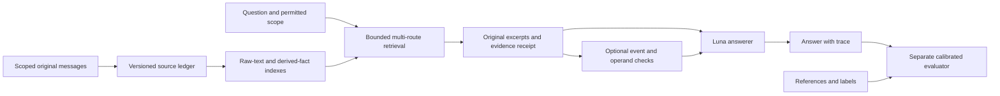

# English foundation after GPT-4o retirement

Research and decision date: October 4, 2026. Status: research-backed design and migration plan; **no new accuracy result, calibrated replacement judge or production architecture is claimed**. The founder retires the GPT-4o family from future calls and asks for a Luna-cost English foundation before Sarvam. This supersedes the prior requirement to use GPT-4o for future measurements, not the historical experiment definitions or their failed gates.

## What our evidence actually says

The full-500 precision-source run used **GPT-5.6 Luna to answer and GPT-4o to judge**, scoring **423/500 (84.6%) once**. The preceding configuration scored 418/500 twice. Historical 82.6% remains an earlier configuration, not a controlled architecture-only comparison with the current one.

The latest selected screen's **92/150 used GPT-5.6 Terra and the balanced prompt**, against Luna plus the standard prompt at 84/150. It changed both model and prompt. Its 13 gains and 5 losses failed the fixed net+15 gate. All 18 changed grades received assistant source review; three gains have source/category ambiguity or likely judge error. That run remains failed under its original protocol. [Saved public metrics](../benchmarks/audits/english-combined-answer-2026-10-04/result.json).

Of 55 earlier misses still wrong in that candidate, prior audit labels identify 32 aggregation/amount and 13 temporal/update cases. All 10 previously labelled fact-retrieval gaps remain wrong. These labels localize development work; they do not prove a single architectural cause for every error. The previous rigid structured-answer variants and lexical excerpt index also failed. We retain their negative evidence.

## Model decision: Luna first, cost measured rather than guessed

Verified official list prices, standard short-context text, USD per million tokens:

| Model | Input | Output | Decision |
| --- | ---: | ---: | --- |
| GPT-5.6 Luna |0.20|1.20|Reference answerer; retain current extracted corpus for the first controlled comparison |
| GPT-6 Luna |0.10|0.50|Low-cost candidate for calibration/model comparison; project access and task quality are untested |
| GPT-5 Mini |0.25|2.00|Modest price increase, but deprecated; do not make it the new foundation |
| GPT-5.4 Mini |0.75|4.50|3.75× Luna token prices; not a slight increase |
| GPT-5.6 Terra |2.00|12.00|10× Luna token prices; research comparator, not the default under this cost preference |

Sources: [5.6 Luna](https://developers.openai.com/api/docs/models/gpt-5.6-luna), [6 Luna](https://developers.openai.com/api/docs/models/gpt-6-luna), [5 Mini](https://developers.openai.com/api/docs/models/gpt-5-mini), [5.4 Mini](https://developers.openai.com/api/docs/models/gpt-5.4-mini), [Terra](https://developers.openai.com/api/docs/models/gpt-5.6-terra). The [deprecation schedule](https://developers.openai.com/api/docs/deprecations) lists the GPT-5 Mini snapshot shutdown for December 11, 2026. Availability in this project's account has not been checked through paid requests.

For an illustrative 9,000 input/500 output-token call, uncached list costs are$0.0024 for 5.6 Luna,$0.00115 for 6 Luna,$0.00325 for 5 Mini,$0.009 for 5.4 Mini and$0.024 for Terra. These are arithmetic examples, not measured run costs. Reasoning output, cache writes, endpoint/service tier and actual token counts change the bill. Pin effort explicitly in new protocols; the old requests omitted it. The [reasoning guide](https://developers.openai.com/api/docs/guides/reasoning) explains that reasoning tokens consume output budget. A five-token GPT-4o judge limit is not a valid drop-in assumption for a reasoning-model judge.

**Recommendation:** retain 5.6 Luna as the controlled answerer; shortlist 6 Luna for the replacement-judge calibration first. Treat it as an unproven candidate despite lower price. A judge must pass task-specific calibration; matching the answerer's family does not make it independent. Keep extraction changes separate from judge and retrieval changes. Do not re-extract everything merely to remove historical model names from provenance.

## What the research supports—and does not

| Primary evidence | Relevant finding | Decision for this project |
| --- | --- | --- |
| [LongMemEval, ICLR2025](https://arxiv.org/html/2410.10813v2), §§5/E | Replacing original rounds with summaries/facts often loses useful information; fact-expanded keys and correctly inferred time filters can help. Correct retrieval does not ensure correct answering. | Preserve original passages and index derived facts alongside them. Evaluate retrieval and answering independently; uncertain time filters must not silently remove evidence. |
| [Zep/Graphiti](https://arxiv.org/html/2501.13956v1), §§2–3 | Separates episodes, entities and relations; records event validity and system time; combines semantic, lexical and graph retrieval. Entity matching remains fallible. | Add explicit temporal/provenance contracts. Graph expansion is an optional channel requiring an ablation, not proof of complete event retrieval. |
| [Mem0](https://arxiv.org/html/2504.19413v1), §§2–4 | Its graph variant helps some categories but does not improve multi-hop performance. Full context has higher judged accuracy in its table, while memory offers efficiency. Adversarial questions were excluded. | Report accuracy, latency and cost together. Do not treat relative headline gains as an absolute expected lift or evidence of abstention quality. |
| [Hindsight](https://arxiv.org/html/2512.12818v1), §§4/7 | Uses distinct evidence types, temporal/entity context and multiple retrieval channels. Its 91.4% configuration uses different memory, answer and judge models from ours. V1 leaves token-budget placeholders and has judge-comparability ambiguity. | Borrow testable design ideas, not a claimed ranking. We have not reproduced its result or audited later revisions. This version does not establish that each component caused its score. |
| [LangGraph memory documentation](https://docs.langchain.com/oss/python/concepts/memory) | Separates thread state from long-term namespaces and distinguishes synchronous from background writes. | Treat scope, freshness and persistence as explicit interfaces. Benchmark a fixed memory snapshot rather than racing background extraction. |
| [MT-Bench judge study](https://arxiv.org/html/2306.05685v4) and [self-preference study](https://arxiv.org/html/2410.21819v2) | Evaluated judges can have position, verbosity, reasoning and self-preference problems. Anonymous model names do not establish independence. | Calibrate the exact proposed judge, blind arm identity and preserve disagreements. These papers do not measure bias magnitude for our current Luna models. |

There is no single published memory-system “industry standard” that guarantees 90%. A defensible competitor must expose its model mix, dataset revision, ingestion method, retrieval budget, judge, exclusions, cost, latency and failure cases. Our current 500 questions are development-exposed. Repeating them cannot make them a sealed generalization test.

## Proposed architecture and concrete boundaries

This is an incremental extension of the current source-preserving pipeline, not a replacement of it with a mandatory fact graph.

1. **Source ledger.** Stable message/session identity, tenant/user scope, speaker, original text, content hash, observation time and source language. Preserve source history for permitted retention; corrections create versions. User deletion must also remove or invalidate derived indexes, caches and retrieval visibility. “Immutable evidence” is not a promise to ignore deletion. No corpus migration is included in this change.
2. **Typed derived evidence.** Facts/events retain source spans, entity, action, object/category, quantity, unit, event-time interval/precision, mention time and completion status. Distinguish user statements, assistant advice, plans, completed events and uncertain inference. Unknown fields remain unknown. Existing extraction already stores some provenance and dates; this fuller contract is a proposal, not a claim that it is absent everywhere or already implemented.
3. **Retrieval.** Keep the current packet as the comparison. Test raw-text lexical retrieval and semantic retrieval with fact-expanded keys; optionally add scoped entity/time expansion. Record each channel's contribution, source IDs, rank, omissions and truncation. Scope filtering applies before retrieval and after joins. Add one channel at a time; a larger graph is not inherently better.
4. **Counts and totals.** Search for the complete eligible event set, not simply the most similar top-k passages. Record why each candidate event is included or excluded, its source-backed quantity/unit and whether two mentions refer to one event. Never replace a missing quantity with one, use fuzzy similarity as event identity or count a related object category. Arithmetic validates operations after operands are supported; it cannot validate membership.
5. **Time and updates.** Keep event time distinct from message time. Preserve old and corrected values with validity intervals. Treat “recently” as an interval or unresolved inference, not a fabricated exact date. An uncertain date filter must broaden or preserve alternatives rather than confidently dropping evidence.
6. **Answering.** Keep original passages available to Luna. Optional bounded evidence notes may help, but must not force every answer through a lossy schema. Report unsupported premises without substituting a nearby fact; allow ordinary justified inference. No hidden second answer, unchecked tool arithmetic or model routing based on benchmark IDs/gold answers.
7. **Execution and product reliability.** Separate retrieval, answering and evaluation interfaces; pin configuration and source hashes; use explicit budgets, attempt accounting and no unrecorded fallback. Before product claims, test cross-user isolation, deletion propagation, idempotent ingestion, concurrent updates, crash recovery and auditability. Current benchmark gates do not certify these production properties.

Current relevant code: [fact retrieval](../llm/fact_retrieval.py), [context assembly](../llm/context_assembler.py), [extraction](../llm/consolidation_v2.py), [supersession](../llm/supersession.py). Their existing scoped retrieval, provenance and budget behavior are foundations to retain. The first useful change is a bounded semantic evidence slice, not a new database or wholesale framework migration. See the [preceding architecture audit](ENGLISH_ARCHITECTURE_DECISION_2026-10-04.md) for failed approaches and implementation limits.

## New judge protocol: prevent an artificial score improvement

The official [LongMemEval evaluator](https://github.com/xiaowu0162/LongMemEval/blob/main/src/evaluation/evaluate_qa.py) checks category-specific reference agreement. It does not receive the source history. Therefore reference-match accuracy and source-grounded correctness must be reported separately.

**Proposed sequence, not yet executed:**

1. Prepare exposed development examples, then lock a separate 120-item validation set: 60 correct and 60 incorrect, covering categories, abstention, wrong entity/quantity/unit/date, incomplete sets, stale updates, misleading related facts and grading-instruction injection. Ground labels in source/reference review, not old GPT-4o verdicts. If review is assistant-only, label it internal calibration; it is not independent human truth. Do not repeatedly tune on failed validation examples.
2. Test one affordable judge first, using anonymous answer IDs, fixed rubric and no answerer identity, old grade or desired score. New transport must explicitly pin supported model settings, reasoning budget, strict verdict format, invalid-output behavior, price and returned-model identity. No substring “yes” acceptance.
3. Proposed internal readiness gate: at least 114/120 correct judgments, at most 3/60 false accepts and 3/60 false rejects, zero critical integrity-fixture failures, and review every disagreement/category weakness. These are project thresholds, not industry certification. Small samples have wide uncertainty; zero errors in 60 cases still allows an approximately 4.9% one-sided 95% upper bound.
4. After calibration and a concrete approved budget, score the **same saved 500 answers** with the new judge. No answer regeneration is necessary for this bridge. Publish `new judge(old answers)` beside the archived 84.6%, identifying the difference as a judge-scale change.
5. Test architecture changes with the same Luna answerer, extracted corpus, prompt, budget and calibrated judge. Engineering lift is `new judge(new answers) − new judge(old answers)`, not the difference from the old judge's84.6%. Review all gains/losses and a fixed sample of unchanged results against source evidence.

If the new judge gives old answers 90%, that is **not** a 90% architectural achievement. A future90% claim must name the new protocol, disclose calibration/source review, report paired improvement and repeat on locked configurations. The old “27 more answers” arithmetic applies to the old 423/500 scoring series; the required new-scale gain is unknown until the bridge exists. No new GPT-4o calls are needed for this migration.

Historical supersession/extraction artifacts may contain GPT-4o-mini judgments. Reusing them preserves comparability and avoids an unnecessary bulk rewrite; describe this as **no new GPT-4o-family inference**, not a clean-room corpus with no GPT-4o ancestry.

## Benchmark ladder and fair comparison

| Track | Purpose and required disclosures | Priority |
| --- | --- | --- |
| Exact existing LongMemEval500 | Continuity on the frozen local dataset; full category/abstention denominators, paired gains/losses, input hashes and judge series | First |
| [LoCoMo](https://github.com/snap-research/locomo) | External conversational transfer; ten released conversations, conversation-level separation and original category metrics. F1 is not interchangeable with LongMemEval judged accuracy | After a candidate passes |
| [MemoryAgentBench](https://arxiv.org/html/2507.05257v1) | Incremental ingestion, conflict resolution and long-range learning; prioritize FactConsolidation. Avoid calling its reused LongMemEval component independent transfer | Small targeted follow-up |
| [BEAM](https://arxiv.org/html/2510.27246v1) | Scale and broader memory behavior; start at 128K rather than the 10M-token tier. Preserve task-specific scoring, including partial credit/order metrics | Later scale gate |
| [LongMemEval-V2](https://github.com/xiaowu0162/LongMemEval-V2) | Agent trajectories and accuracy–latency evaluation; separate series. Its backend interface hides evaluation IDs/types/gold and enforces context budgets | Future product-facing track |

The [original LongMemEval repository](https://github.com/xiaowu0162/LongMemEval) now lists cleaned histories and V2. We must pin the existing local artifact and never silently upgrade it. Scores from versions, exclusions or judges that differ are not a common leaderboard. The benchmark ladder is deliberately sequential; running all suites before fixing counting evidence would waste budget.

For each architecture comparison include a no-memory control, a budget-matched raw-history/RAG baseline, the current pipeline and an oracle-evidence diagnostic where useful. Oracle evidence is an analysis aid, not a deployable result or guaranteed performance ceiling. Report all-required-span recall, complete-event-set recall, entity/unit/date fidelity, stale-fact selection, false abstention, unsupported answers, p50/p95 query latency, ingestion/query cost and index growth. Inference settings and cached-token assumptions belong next to cost claims.

## Ordered work with exit criteria

| Order | Deliverable | Exit criterion |
| --- | --- | --- |
|0|Retire future GPT-4o-family calls; preserve results|Known paid boundaries reject retired models; offline historical verification still works; archive hashes unchanged |
|1|Versioned evaluator contract and calibration assets|Separate model roles; no gold in runtime; source-reviewed development/locked validation split; no paid launch until transport/budget package is reviewable |
|2|Offline evidence fixtures and one prototype|Count membership, quantities, duplicate identity, time/update and false-premise cases; zero unsupported admissions/scope violations; audit omissions; preserve unaffected packets |
|3|Calibrate one cheap judge, then bridge saved answers|Pass predeclared calibration criteria; record all disagreements; new-scale baseline distinct from historical score |
|4|Same-model paired architecture test|Freeze numeric gain/regression/cost gates before paid outputs; no changing thresholds after results; preserve every failure |
|5|Full500 measurement, repeat and transfer test|Stable new-protocol result with source-review qualifications and at least one separate transfer check before claiming general industry competitiveness |

Thirteen [published development fixtures](../benchmarks/fixtures/evidence_semantics_v1.json) now make these boundaries concrete: category/attribute attachment, count units, duplicate versus distinct events, completion status, approximate/relative dates, corrections, missing comparison operands, unit conversion, speaker provenance and grading-instruction injection. Their IDs and evidence references pass data-integrity checks. No model was evaluated on them, they are not the proposed120-item validation set, and they are not sealed. The [versioned protocol specification](../benchmarks/protocols/english_luna_foundation_v1.json) records the model roles, evaluator boundary, bridge and paid-readiness blockers. It is deliberately non-executable.

Stages1–2 can proceed offline now. No new paid run is authorized merely by selecting a model or preparing a plan. The next concrete engineering artifact is a versioned evaluation contract and semantic evidence fixture suite. It should cover the actual failure mechanisms with varied names, dates and values; copying benchmark answers into routing rules is prohibited. A validation set inspected during development must be relabelled exposed, not called sealed.

There is no evidence-backed date for 90%. Work can be completed in focused sessions without arbitrary multi-day waits, but research payoff remains uncertain. Sarvam stays parked under the founder's current instruction; the unresolved English target continues to carry a startup-program timing cost. This plan makes that tradeoff explicit rather than silently lowering quality or declaring closure.

## Research method and scope

We reviewed primary papers, official benchmark repositories and current provider documentation, including four memory-architecture papers in depth and focused judge/benchmark research. The questions were: affordable models; evidence storage/retrieval; reliable judge migration; benchmark comparability; and a bounded implementation path tied to local failures. Exact-version citations above are deliberate. Paper results are authors' reported findings, not reproductions by this project. Current account access, every competing implementation, all literature and production readiness were not exhaustively verified. Local source review was scoped to relevant pipeline and execution boundaries. The detailed source register and historical preservation ledger are retained in the project's separate durable memory.
