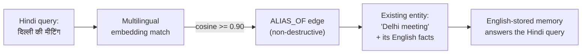

# Cross-Lingual Memory: The Layer Nobody Has Built

India's AI stacks are learning to *speak* 22 languages. None of them can
*remember* across two. This document is the problem statement, what already
works in this repo today, and the measured roadmap.

---

## The problem, in one user

Meet a real pattern, not an edge case: a user talks to a voice agent in
Hindi on Monday ("मेरी बेटी की शादी दिसंबर में है" - my daughter's wedding
is in December), then types in English on Thursday ("what flowers did I say
I wanted?"). Every production memory system today (Mem0, Zep, Letta,
LangMem, all built English-first) stores Monday and Thursday as two
strangers. The Hindi fact does not resolve to the English query. The user
repeats themselves, and the "memory" product has amnesia precisely for the
users who code-mix, which in India is most users.

This is a known, publicly acknowledged gap, not our invention: the leading
graph-memory vendor has multiple open GitHub issues requesting exactly
cross-lingual entity resolution
([#1141](https://github.com/getzep/graphiti/issues/1141),
[#1380](https://github.com/getzep/graphiti/issues/1380),
[#312](https://github.com/getzep/graphiti/issues/312),
[#434](https://github.com/getzep/graphiti/issues/434)), with an FAQ answer
of "on the roadmap." No memory vendor publishes a cross-lingual recall
number. There is no benchmark for one to publish. That absence is the
opportunity.

## What already works in this repo, measured

Cross-lingual entity aliasing is live in the knowledge graph today, not a
slide. An Indic-script mention links to an entity the graph already knows
through an embedding match (multilingual-e5-small), stored as a
non-destructive `ALIAS_OF` edge:

Measured on a hand-labeled English/Hindi/Tamil set with adversarial hard
negatives, published at every threshold (the honest table, including the
operating points that fail):

| Threshold | Precision | Recall | F1 |
|---|---|---|---|
| 0.80 | 0.135 | 1.000 | 0.238 |
| 0.85 | 0.422 | 0.900 | 0.575 |
| **0.90 (ships as default)** | **0.762** | **0.533** | **0.628** |
| 0.95 | 1.000 | 0.200 | 0.333 |

Known surviving failure, disclosed rather than hidden: two phonetically
similar but unrelated places (Chennai / China) still cross the 0.90
threshold. The design absorbs this safely: an alias edge can add retrieval
reach but can never merge nodes or corrupt a fact. A false alias costs
noise, never truth.

The substrate under this is the same engine documented in
[BENCHMARKS.md](BENCHMARKS.md): 80.0% ± 0.5 on the full LongMemEval `_s` in English
with full protocol disclosure, local-first extraction at $0 per
conversation, and a bi-temporal knowledge graph. The cross-lingual layer is
not a pivot away from that work; it is what that work was for. A memory
layer must first demonstrably work in one language before "works across
languages" means anything.

## Why this matters commercially, not just technically

- **Voice-first users are the growth frontier.** India's voice AI stacks
  (Sarvam and others) handle code-mixed speech natively. Agents built on
  them need memory that survives the code-mixing their users actually do.
- **Token economics are worse in Indic scripts.** Devanagari and Tamil
  commonly cost 2 to 4x more tokens per character than English under
  standard tokenizers. A memory layer that compresses 115k tokens of
  history into ~10k of relevant context (our measured operating point) is
  cosmetic in English and decisive in Hindi.
- **Privacy is not optional at India scale.** Our extraction runs on a
  local 8B model. Conversations never leave the device to build memory.

## The roadmap, with measurement gates

Each phase ships with its own benchmark number or it did not happen. This
mirrors how the English baseline was built (see
[DECISIONS.md](DECISIONS.md), D8).

**Phase 1: X-CRS, the cross-lingual recall benchmark.**
Store facts in language A, query in language B, across English + Hindi +
Tamil (then Telugu, Bengali). Metric: X-CRS (cross-lingual recall score),
defined so that monolingual recall and cross-lingual recall are separately
reported. Nobody publishes this number today; we intend to publish the
first, including our failures on it.
Status: metric design drafted, eval set labeling in progress.
Result: _pending_.

**Phase 2: Voice-path memory (V-CRS).**
The same benchmark through a real speech pipeline (ASR in, TTS out), so
recognition noise is part of the measurement, not an excuse. Designed to
run on production Indic voice APIs (Sarvam's Saaras/Bulbul class of stack).
Result: _pending_.

**Phase 3: Code-mixed extraction hardening.**
Hinglish and Tanglish transcripts through the extraction validators;
measure fact-survival rates per language mix. Known open issue already
logged: Hindi conversations currently yield zero extracted facts in one
pipeline path. It is in this repo's issue tracker because roadmaps that
hide their bugs are marketing.
Result: _pending_.

**Phase 4: The cross-lingual head-to-head.**
The English head-to-head harness (real competitor libraries, same
answerer, same judge) re-run on the cross-lingual set. Expected outcome,
stated before running it: most incumbents will score near zero, because
they were never built for this. The interesting number is ours.
Result: _pending_.

---

*If you work on Indic NLP, speech, or agent infrastructure and want to
argue with the metric design before we freeze it, open an issue. Benchmark
designs are exactly the thing that should be argued about in public.*
