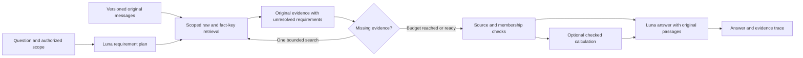

# Fixed-Luna architecture: diagnosis, design and falsifiable research plan

October 4, 2026. Three GPT-6 Sol agents independently examined failure mechanisms, memory literature and reasoning/evaluation design. Root checked the synthesis, current Git state and source evidence, and implemented a reproducible offline focus-capacity diagnostic. **No new answers, paid benchmark calls, model promotion or accuracy gain occurred.** The architecture below is a proposed sequence; only the diagnostic tool is implemented here.

The current saved Luna answers score **423/500 (84.6%) under historical GPT-4o judgment**, and **425/500 (85.0%) under provisional Terra judgment**. Those are two grading scales for identical answers. This investigation does not close English or establish 90%.

## Evidence-backed diagnosis

| Finding | Evidence | Architectural implication |
| --- | --- | --- |
| Several failures occur despite delivered operands | Saved cases include train $10 plus taxi about $60 answered as $30–$40 (`09ba9854`); two dated March missed runs answered as one (`21d02d0d`) | Identify the requested operation and eligible operands; retrieval alone is insufficient |
| A cited extracted fact can omit the needed event | Smoker case `gpt4_8279ba02`: source says acquired March 15; delivered linked facts retain wood-use plans but omit acquisition; answer says not mentioned | Derived keys should locate original values, not replace them; recover missing source turns |
| Current retrieval does not establish complete event sets | TF-IDF fact ranking, entity recall and rank-limited packet assembly select relevance, not exhaustive membership | Search separately for required entities/events/operands; measure omissions and false inclusions |
| Answer instructions may encourage guessing across different premises | Frozen prompt says partial evidence is evidence and forbids “not mentioned” unless the search list is empty; false-premise misses confuse planned/completed, iPhone/iPad and engineer/manager | This mechanism is not causally isolated; test it in a prompt-only arm. Related evidence must not satisfy a different entity or event state |
| Stronger models help, but do not solve the tail | Matched model-only diagnostic: exact-evidence targets Luna3/25→Terra10/25, eight gains/one loss; 15/15 controls retained; 14 targets wrong in both arms | Model capacity is real, but architecture still has work. Do not claim model strength is irrelevant |
| Structured arithmetic already failed locally | Historical variants57.3%/65.3% against about76% in their own experiment; missing counts defaulted to one, units and membership were wrong | Do not revive a compulsory schema or assume correct arithmetic validates the input set |
| Some measured misses belong to evaluation/source ambiguity | Bridge audit found a clear temporal rubric error, likely preference errors, and a charity-source ambiguity. This review also rechecked `9ee3ecd6`: its answer explicitly includes “100 more,” matching the reference100 despite shared rejection | Preserve reference scores and separately review source correctness; do not optimize to judge mistakes |

Code anchors: [fact ranking](../llm/fact_retrieval.py), [packet assembly](../llm/context_assembler.py), [answer prompt](../benchmarks/qa_accuracy_eval.py), [historical structured path](../benchmarks/structured_answer.py). Supporting reports: [prior diagnosis](ENGLISH_ARCHITECTURE_DECISION_2026-10-04.md), [bridge audit](results/TERRA_BRIDGE_2026-10-04.md), [historical precision audit](../benchmarks/audits/english-source-precision-2026-09-14/REPORT.md). The train packet also includes conflicting assistant fare advice: delivered operands establish a selection/answer-use issue, not proof that subtraction alone failed. An initial draft incorrectly called the loyalty-points case an operand error; exact saved-answer review corrected that attribution before merge. Concrete case evidence and a 75-case census remain in the external memory research directory identified below. The findings do not establish the complete semantics of every failing case.

### Current failures, with honest denominators

Terra rejects75:37multi-session,15temporal,11abstention,6preference,4knowledge-update,1single-user and1single-assistant. These are benchmark categories, not causes. Sixty-eight overlap the previous77misses; seven are new Terra rejections and nine old misses now pass.

Reindexing the old stage audit onto those68 yields27linked-fact-delivered/raw-source-missing,19all-annotated-source-delivered,10linked-fact-absent,10sufficiency/judge and2extraction-lineage gaps. **These are historical diagnostic proxies, not a causal breakdown of today's75.** In particular, the27linked-fact cases are not proved semantically sufficient, and all-source-present does not prove the judge or reference is right.

### New measured limit of the existing focus prototype

The append-only prototype can select up to8original turns already in the baseline, inside a4,000-character focus allowance and40,000-character total cap. The new offline audit verifies all500saved input hashes and their bridge-context bindings.

| Length-only bound | All500 | Terra75misses |
| --- | ---: | ---: |
| Cannot append even the shortest original turn |2|0|
| Cannot fit eight shortest original turns |81|13|
| At least one original turn cannot fit alone |180|25|
| Median free characters |3,634|3,807|

Eight turns are a cap, not a requirement. These counts do not mean25answers fail because of length, nor predict any gain. Every current miss can fit at least two shortest turns. The separate input inventory has median selector request size about28.8kUTF-8bytes; bytes are not tokens or a bill. Adding a strong selector over that input must be costed, not treated as free infrastructure.

The tool is [audit_focus_capacity.py](../benchmarks/audit_focus_capacity.py). Nine new tests compare its bound with actual rendering for every nonempty subset of a small pool across seven budgets, check non-fit preservation and reject tampered, truncated and changed-request artifacts;26existing focus tests also pass. This proves diagnostic behavior, not selection quality. The existing selector remains unmeasured and disabled by default.

## Design decision: Luna throughout the query path

The primary hypothesis is **higher accuracy with Luna planning and answering, at bounded total query cost**. A Terra selector feeding Luna is a mixed-model system; keep it only as a separately named diagnostic/comparator. Terra grading is an evaluation cost, separate from serving inference. Existing extraction has historical GPT-4o-family ancestry, so the initial study can claim fixed-corpus, Luna-only query inference—not an entirely small-model-built corpus. The GPT-6 Sol research agents are development tools, not inference components.

This is an incremental branch around existing storage and retrieval, not a database rewrite. A hard counter permits at most one follow-up search; the diagram's loop does not authorize unlimited calls. Retrieval and planning remain uncertain semantic operations.

1. **Plan what must be known.** A bounded requirement object names the requested entity, object category, event state, operation, operands, time interval/precision and output unit. Unknown fields remain unresolved. The object is not an answer, and no benchmark IDs, types, gold values or earlier grades reach it. Start with explicit counting/amount/date-comparison questions; do not route on known failure IDs.
2. **Retrieve original evidence for each requirement.** Retain raw turns and existing derived keys. Use the current lexical path first; expose missing comparison operands, conflicting updates and alternative entity interpretations. Permit one targeted follow-up search only in the authorized corpus. Record which requirements remain unresolved. No web search for private-history facts. Dense or graph expansion is a later independent lever, not part of the first implementation.
3. **Preserve source meaning while packing.** Each excerpt carries stable versioned source identity, role, observation time, original text and offsets; deletion must propagate to derived indexes, packets and caches under the retention policy; event time is separate and can be approximate. Keep enough surrounding text to preserve negation, quantity attachment and event identity. Original turns remain accessible. First isolate append-only focus as an attention experiment; any replacement/repacking is a separate variant with an explicit removed-evidence audit and equal-budget control. Never silently drop evidence to make the new packet fit.
4. **Check membership before calculation.** Record admitted/excluded/unresolved candidates, not merely a final operand list. Plans are not completions; assistant suggestions are not user actions; mentions are not distinct events; item quantities are not event counts. Code checks scope, offsets, hashes, unit compatibility and computation. A model's “complete” claim is only a hypothesis: no programmatic certificate establishes semantic completeness over natural language.
5. **Compute only justified operations.** Use exact decimal arithmetic, explicit units and calendar conventions. Unknown quantities have no default. Ambiguous event identity or date precision blocks a definitive calculation, while preserving the original prose for Luna. Do not run untrusted generated programs or invent a missing operand. Disable the optional branch on invalid plans; log the disposition, retain the reference path and count its cost.
6. **Answer the actual question or expose the gap.** The final Luna response must address the requested entity/state/unit. An unsupported premise can require abstention even when related facts exist. This conflicts with the current “last resort” wording, so evaluate the instruction change as a separate prompt arm before combining it with retrieval changes. Formatting checks must not become a hidden answer rewrite or unrecorded retry.

The design aims to reduce the amount of implicit selection and arithmetic Luna must perform in a crowded packet. It does not eliminate model reasoning or guarantee that a smaller model matches every larger model.

## Research grounding and novelty limits

The source register contains24distinct primary papers/repositories, including current memory work and foundational retrieval/reasoning studies. Searches were scoped and deep reading targeted; nobody scanned the entire internet or reproduced competitor scores. Exa/Firecrawl were unavailable, so the ECC research workflow used the web tool. ECC architecture-audit guided the local mechanism review. The similarly named benchmark-methodology skill was inspected but not applied because it concerns branding comparisons.

- Preserve original values alongside retrieval keys; assess indexing, retrieval and reading separately. [LongMemEval](https://arxiv.org/html/2410.10813v2)
- Treat graph search as an ablation, not automatic superiority; its value depends on representation and extraction. [Does Memory Need Graphs?](https://aclanthology.org/2026.acl-long.1232/)
- Iterative evidence search and sufficiency stopping already exist. [MemRetriever](https://arxiv.org/html/2609.11951v1)
- Separating encoding, retrieval and evidence-conditioned generation failures is also prior work. [EvalMem](https://arxiv.org/html/2609.22231v1)
- Offloading calculations and interleaving retrieval with reasoning motivate controlled components, not a guarantee of correct operands. [PAL](https://proceedings.mlr.press/v202/gao23f.html), [IRCoT](https://aclanthology.org/2023.acl-long.557/)

**Potential paper contribution:** a reproducible, low-cost study of source-preserving requirement coverage and semantic event membership under a fixed small query model, including failure attribution, inference-cost controls and negative results. This is a hypothesis, not a novelty or acceptance claim. The stronger claim would require showing an advantage over existing alternatives at matched budgets on independent data. A new name or a90%score on development-exposed questions is insufficient.

See the [source register and audit summary](results/luna-architecture-research-2026-10-04.json). Detailed research reports, source registers, source-linked failure census and raw capacity inputs are local external memory at `../codex-memory-2026-09-08/plans/2026-10-04-architecture-depth/`; public summaries do not claim raw artifacts are Git-backed.

## Sequential execution and stop rules

| Step | Concrete deliverable | Exit requirement |
| --- | --- | --- |
|1 — completed here|Current failure census, literature critique, focus feasibility tool and design|Counts reconciled, source links/proxies qualified, diagnostic tests pass; no accuracy claim|
|2 — next engineering task|Gold-blind Luna requirement/selection adapter plus original-span receipts;13exposed fixtures, adversarial variants and preserved reference path|Offline no leakage/scope violation, no missing-value defaults, no silent non-fit; freeze request hashes and total-cost accounting|
|3 — separately approved selection diagnostic|Luna selector first; Terra only as separately priced comparator if useful|All13required/excluded evidence tests pass; preserve failure outcomes; passing exposed fixtures is not validation|
|4 — controlled answering screen|Fixed Luna and judge; one component differs per arm|Freeze cohort, primary paired gain, regression/abstention, cost/latency gates before outputs; audit all changed grades and sampled agreements|
|5 — full measurement, repeat, external transfer|Locked full500configuration plus unchanged repeat and independent English evaluation|Publish both runs, all failures and named judge; generalization requires disjoint conversations/data, not relabelled exposed500|

The previous “Terra focus next” plan is revised: Luna query inference is now the primary design; the existing Terra prototype is preserved as a comparator. No previously frozen paid package is edited, and no paid selection request is authorized by this research.

For step4compare the current pipeline, a budget-matched extra Luna call, Luna focus, then—only if justified—one missing-evidence retrieval extension and one checked-operation extension. Include a separately measured prompt-only abstention arm. Avoid a large combined model/prompt/retrieval change that hides the cause. Report natural cost and equal-total-cost comparisons, including all planner, selector, verification and failed calls, reasoning tokens and p50/p95 latency. Do not call an extra-call gain an architecture-only efficiency gain without that control.

Every predeclared eligible case remains in the denominator, including routing failures, invalid plans, non-fit treatments and abstentions. Before a publishable selection claim, require a separately frozen unseen source-reviewed semantic-membership set; passing the13exposed fixtures is readiness only.

Report all-required-evidence recall, false inclusions/exclusions, event duplication, unit/date/entity errors, false abstention and unsupported answers alongside reference accuracy. Gold/source evidence is allowed in diagnostics, never in runtime retrieval. Selected miss cohorts cannot serve as a500-case headline. Use paired uncertainty estimates and repeat variability; author-reviewed labels must remain labelled internal. If tuning follows validation, that validation becomes development material.

At425/500, reaching90%requires25net additional correct grades; exceeding90%requires26. This arithmetic is not demonstrated headroom. No date or score is promised. English remains open and Sarvam remains parked under the founder's direction.
